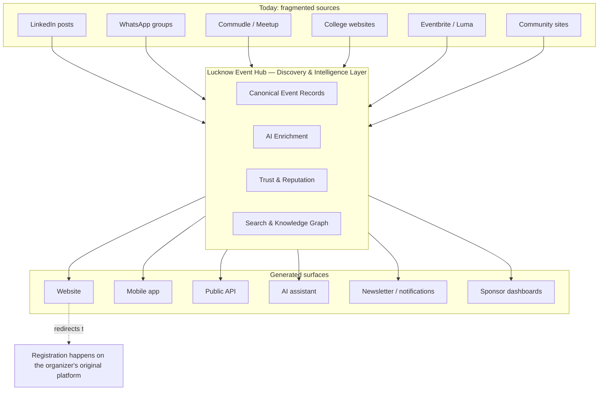
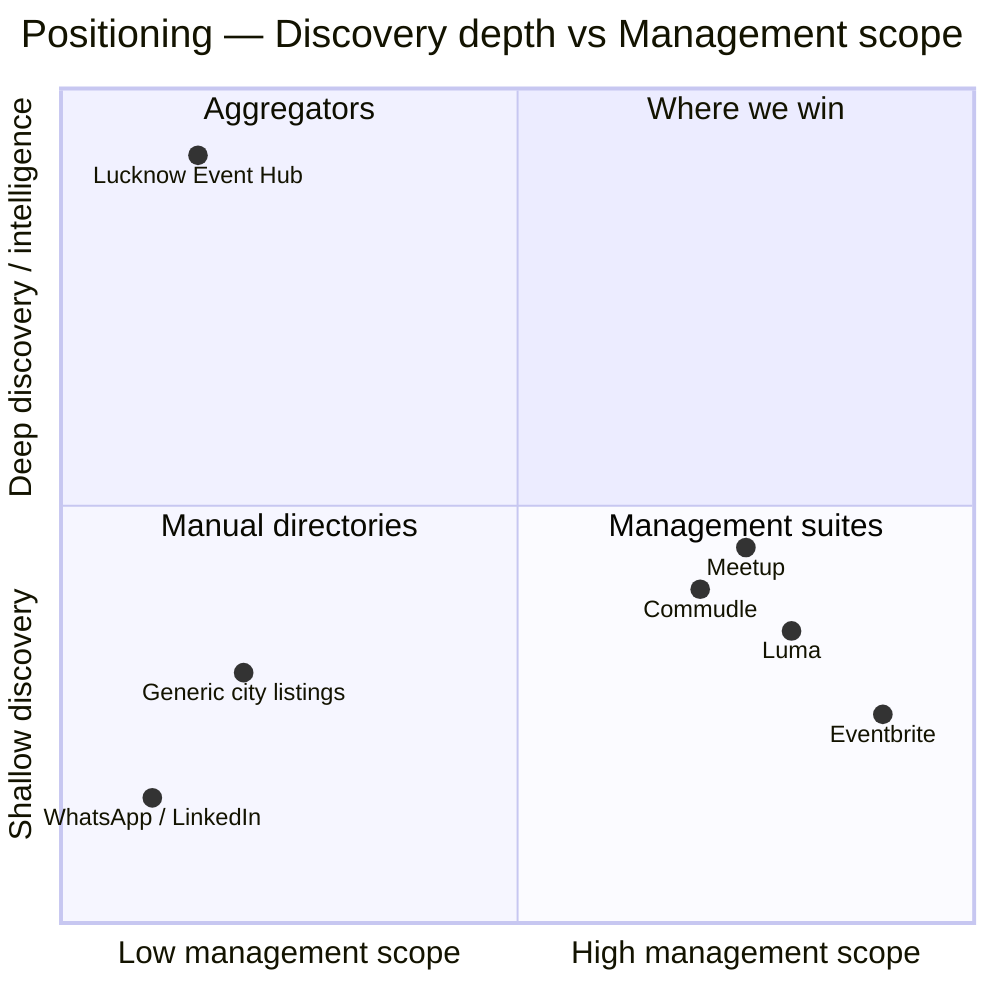
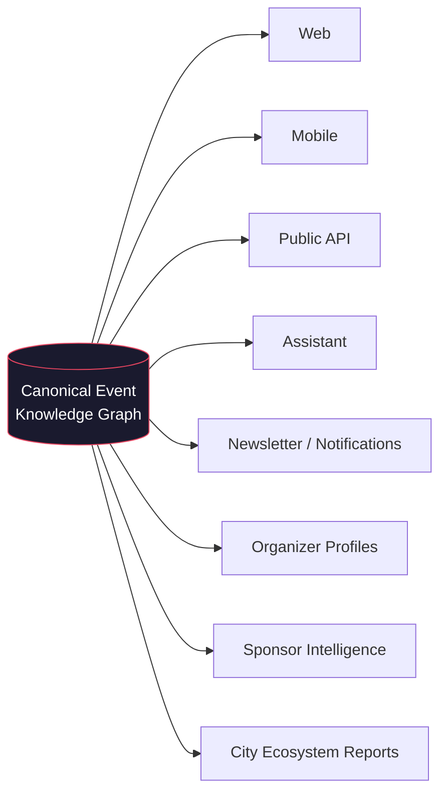
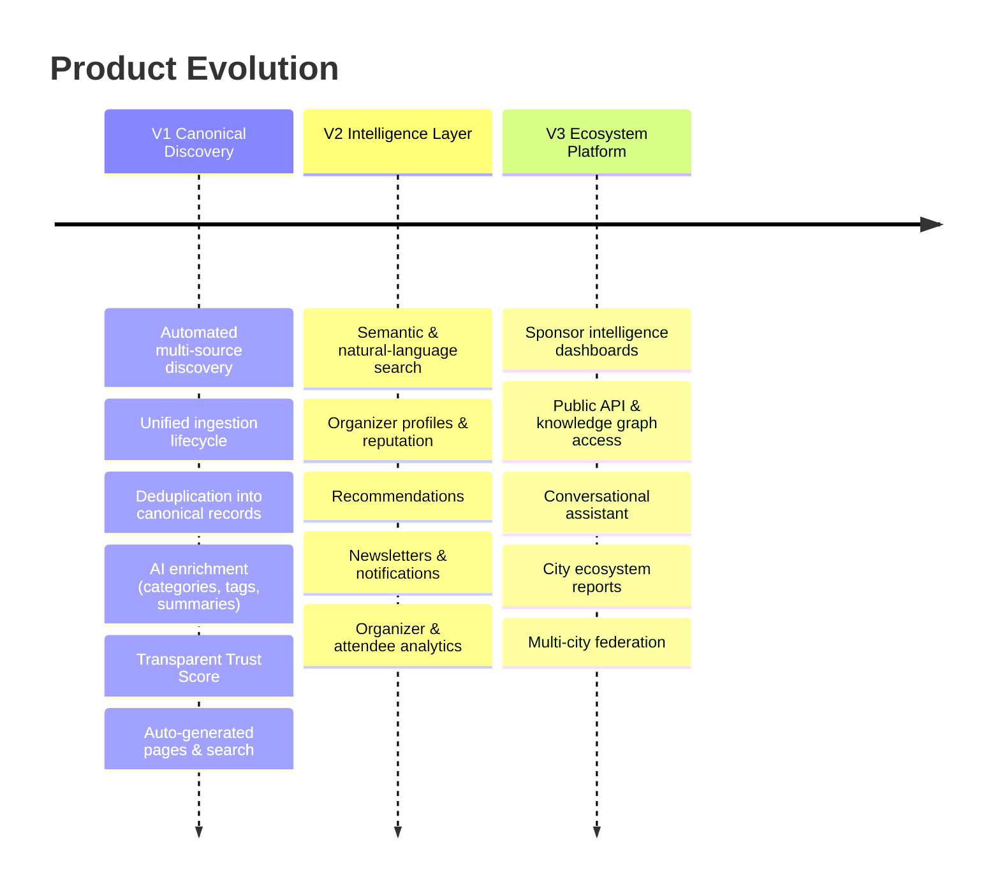

# 02 — Product Vision: City Event Hub Platform

> **Panel authors:** Principal Product Manager · Principal Software Architect · AI Platform Architect · UX Lead · Founder · Staff Backend Engineer
> **Document type:** Strategic product vision (implementation-agnostic)
> **Companion docs:** `03_PRD.md`, `04_Architecture_Decision_Record.md`, `05_Domain_Model.md`
> **⟳ Evolved (Platform Evolution):** Renamed from *Lucknow Event Hub* to *City Event Hub Platform*. Lucknow is now **the first deployment**, not the product. Rationale and full change record in `10_Architecture_Evolution.md`. Sections amended: Mission, Vision, Positioning, Design Principles, Future Vision, Roadmap, Success Metrics. Core Philosophy is preserved (still valid at the deployment level).

---

## Mission

**Make it impossible to miss a tech event in your community — and give every community the platform to run its own.**

We turn a fragmented, tribal-knowledge scatter of announcements — LinkedIn posts, WhatsApp forwards, Commudle pages, college notice boards — into a single, trustworthy, structured record of everything happening in a community's technology ecosystem. And we ship that capability as a **reusable, open-source platform** any city, campus, community, organization, or country can deploy as its own instance — no code changes required.

*Lucknow is our first deployment and reference instance, not the product.*

## Vision

**To become the open-source platform that powers canonical, community-scale knowledge graphs of technology events — one instance per community, one shared codebase.**

In three years, when someone in Lucknow, Delhi, a university campus, or a startup community asks *"what's happening this weekend in AI?"*, the answer comes from *their* deployment of this platform — on the web, in an app, through an assistant, in a newsletter, or via an API. Each community owns its instance, its branding, its sources, and its data; all of them run the same maintainable core.

## The one-sentence positioning

> We are the **open-source discovery-and-intelligence platform** for community tech events — deployable per community, never a management, ticketing, or hosting layer, and never a single-city application.

---

## Core Philosophy

The panel aligns on five non-negotiable beliefs. Everything downstream — the PRD, the architecture, the domain model — is a consequence of these.

1. **The event is the primary object.** Every page, card, category, calendar entry, search result, feed, and notification is a *projection* of a single structured event record. Nothing is authored by hand. *(Founder + Architect)*

2. **The canonical record is the single source of truth.** The same event announced in five places is *one* event with five pieces of evidence — never five listings. Merging is a first-class capability, not cleanup. *(Staff Engineer + AI Platform Architect)*

3. **All events flow through one lifecycle.** A manual submission, a scraped Commudle page, and a future email-newsletter ingestion enter the *same* pipeline. No source gets special-cased. Sources are pluggable; the lifecycle is fixed. *(Architect)*

4. **AI enriches; deterministic logic decides.** AI extracts, summarizes, categorizes, and scores similarity. But *publish/reject*, *merge/split*, and *trust* are governed by transparent, explainable rules. We never ship a black box that decides what the city sees. *(AI Platform Architect + PM)*

5. **We earn the word "canonical" through trust, not volume.** A wrong date or a dead registration link costs more than a missing event. Correctness and transparency are the product. *(PM + UX Lead)*

---

## Design Principles

| # | Principle | What it means in practice |
|---|---|---|
| 1 | **Event-centric domain model** | The `Event` is the atom. Organizers, venues, categories, feeds, and profiles are derived or attached, never primary. |
| 2 | **Single source of truth** | One canonical record per real-world event; all surfaces read from it. |
| 3 | **Automation over manual work** | Humans review edge cases and set policy — they never do data entry. |
| 4 | **Source-agnostic ingestion** | Adding a source is configuration, not re-architecture. |
| 5 | **Explainable AI** | Every AI-influenced outcome (category, merge, trust) can show *why*. |
| 6 | **Transparent scoring & ranking** | Trust Score and "Featured" are rule-based and inspectable — never paid or hand-picked. |
| 7 | **Search-first experience** | Discovery beats browsing. The default action is *find*, not *scroll*. |
| 8 | **Documentation-first development** | The domain and its rules are written down before they are built. |
| 9 | **Interfaces are replaceable; the graph is not** | The website is one client. The durable asset is the structured data. |
| 10 | **Quality over popularity** | Signals measure reliability and completeness, not hype. |
| 11 | **Configuration over code** *(new)* | A deployment (city/campus/community) is defined entirely by configuration — branding, domain, timezone, language, sources, categories, features, providers. Changing or adding a community never touches business logic. |
| 12 | **Tenant is the deployment boundary** *(new)* | Every domain entity belongs to a tenant. One codebase serves one self-hosted community or many communities from a single deployment. |
| 13 | **Everything pluggable** *(new)* | Scrapers, AI, notifications, auth, search, and analytics are plugins behind stable interfaces. The core depends on contracts, never on a single implementation. |
| 14 | **Open-source by default** *(new)* | Built for external contributors: modular, documented, testable, forkable, and deployable by someone who has never met the maintainers. |

---

## What This Platform Is (and the layer it occupies)

We sit **between** the chaos of sources and the surfaces people use — we are the structuring layer. Registration always redirects out.

---

## Competitive Positioning

The category we compete in is *discovery*, not *management*. Most incumbents are management platforms that happen to have a directory; we are a discovery platform that never manages anything.

| Competitor | What they are | Why we are different |
|---|---|---|
| Meetup / Commudle | Community *management* + hosting | They own the events *on their platform only*. We aggregate across *all* platforms and never host. |
| Eventbrite / Luma | Ticketing + registration | We never handle registration; we index theirs. |
| Generic city event listings | Manually curated directories | We are fully automated, deduplicated, trust-scored, and structured. |
| WhatsApp / LinkedIn | Where announcements *originate* | We are where they get *organized* — the intelligence layer over the noise. |

**Defensible moat:** the accumulated, cleaned, deduplicated, trust-scored **structured event history of the city** — a knowledge graph no single-platform incumbent can assemble, because none of them see across all the others.

---

## Non-Goals (what we deliberately refuse to build)

- **Event management software** — no scheduling, agendas, or check-in.
- **Ticketing / registration / payments** — always external, always a redirect.
- **Event hosting** — we do not run pages *for* organizers to collect RSVPs.
- **Organizer CRM** — we do not manage an organizer's attendee relationships.
- **Manual curation as the primary mechanism** — humans set policy and handle exceptions; automation is the default.
- **Popularity-based ranking / paid featuring** — trust and relevance are earned and transparent, never purchased.
- **A general (non-tech) event platform in V1** — scope discipline: technology events in Lucknow first.

Non-goals are a strategy, not a limitation. Every one of them keeps us in the discovery layer where our moat compounds.

---

## Future Vision (the 3–5 year horizon)

The website is the first interface, not the product. The product is the **open-source platform** that produces a **structured event knowledge graph per community**, which will progressively power (per deployment):

- A **recommendation engine** ("events for you") built on interaction + semantic signals.
- **Natural-language and semantic search** ("beginner-friendly cloud workshops next month near Gomti Nagar").
- **Organizer identity & reputation** — the public credibility layer for communities.
- **Sponsor intelligence** — technology trends, community activity, and audience distribution across the city.
- **A conversational assistant** answering ecosystem questions from the graph.
- **Notifications & newsletters** — proactive discovery instead of pull-only browsing.
- **A public API** — letting others build on the city's event graph.
- **Community ecosystem reports** — the authoritative annual state of each community's tech scene.
- **Multi-deployment federation (now a core product line, not a horizon):** any city, campus, community, organization, or country stands up its own instance from configuration alone — Delhi, Bengaluru, Hyderabad, Pune, Jaipur, Mumbai, Kathmandu, Singapore, a university campus, a startup community. Lucknow is the reference deployment of a repeatable, open-source platform. *(This supersedes the earlier "federation horizon" framing — see `10_Architecture_Evolution.md` and `11_Multi_Tenant_Architecture.md`.)*

---

## Version Roadmap (strategic)

Detailed epics live in `03_PRD.md`; this is the strategic arc.

| Version | Theme | The bet |
|---|---|---|
| **V1** | *Canonical Discovery* | If we can reliably discover, dedupe, and trust-score every event, we become the default place to look. |
| **V2** | *Intelligence Layer* | If discovery is great, identity (organizers) and proactivity (recommendations, notifications) create daily habit. |
| **V3** | *Ecosystem Platform* | If we hold the city's structured event history, we become infrastructure others build and pay for. |

---

## Success Metrics (North Star + supporting)

**Per-deployment North Star:** *Coverage-with-Trust* — **the percentage of real events in a given deployment's scope that are discovered, correctly structured, and published with a valid registration link within 24 hours of first public announcement.** (Applies to each instance — Lucknow, Delhi, a campus — independently.)

**Platform North Star *(new)*:** *Adoption-with-Health* — **the number of independent, actively-maintained deployments running the platform**, weighted by each meeting a minimum data-quality bar. A platform succeeds when others run it, not when one city thrives.

These encode the whole thesis: canonical (coverage), fast (freshness), correct (trust), and *reusable* (adoption). Supporting metrics in `03_PRD.md`.

| Level | Category | Metric | Why it matters |
|---|---|---|---|
| Deployment | Coverage | % of known events captured | Is this instance canonical? |
| Deployment | Freshness | Median announcement → published | Is it timely? |
| Deployment | Quality | Dedup precision/recall; completeness; dead-link rate | Is it trustworthy? |
| Deployment | Engagement | Weekly active discoverers; search success rate | Is it useful? |
| Deployment | Value hand-off | Click-through to organizer registration | Real outcomes? |
| **Platform** | **Adoption** | **# active deployments; time-to-launch a new instance** | **Is it reusable?** |
| **Platform** | **Community** | **External contributors; merged community plugins; PRs** | **Is it a living OSS project?** |

---

## Panel closing note

The **Founder** frames the ambition (canonical, city-scale, multi-surface). The **PM** and **UX Lead** insist that trust and search-first discovery are the product, not features. The **Architect** and **Staff Engineer** hold the line that a fixed lifecycle + pluggable sources is what makes the ambition *maintainable*. The **AI Platform Architect** guarantees that intelligence stays *explainable*. This document is the contract between those perspectives.
