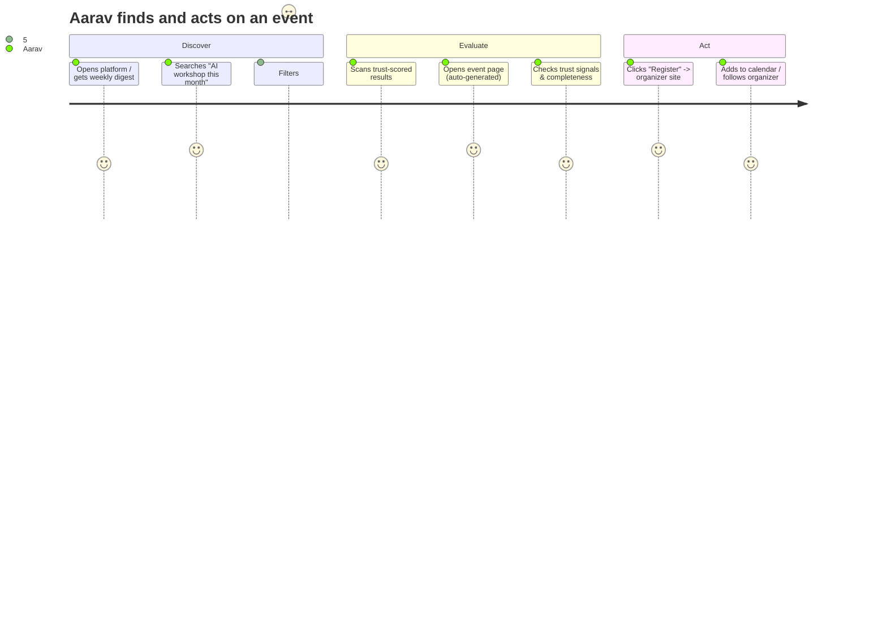
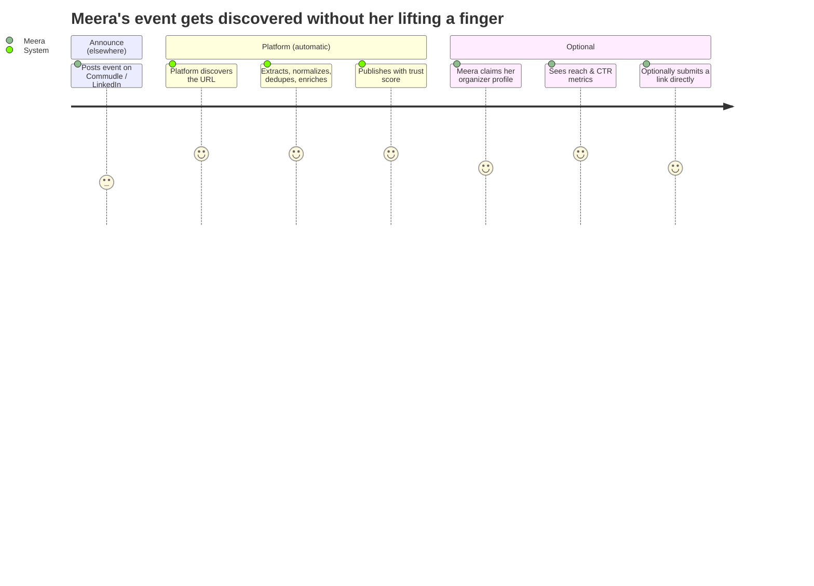
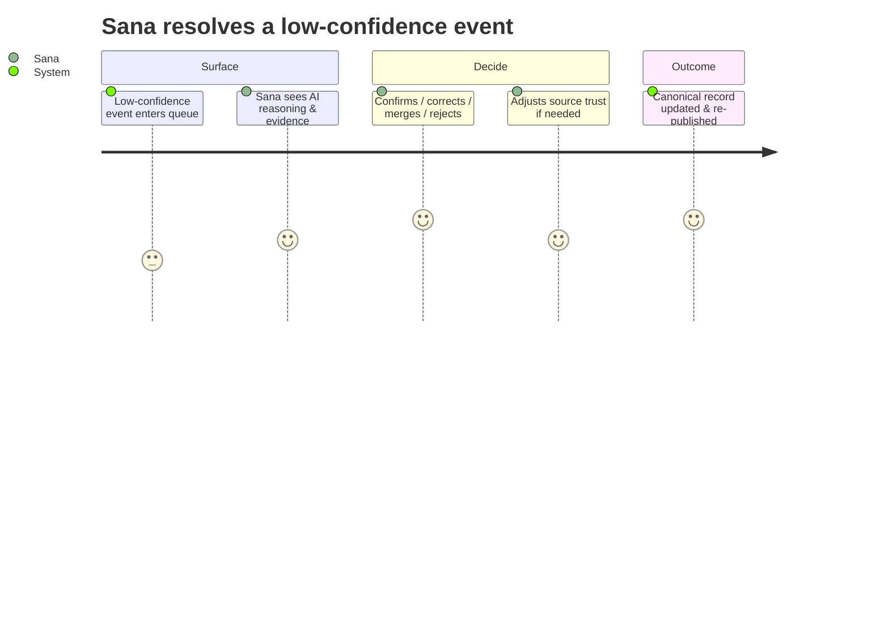
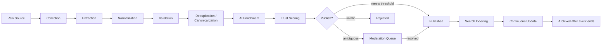

# 03 — Product Requirements Document (PRD): City Event Hub Platform

> **Panel authors:** Principal Product Manager (lead) · UX Lead · AI Platform Architect · Founder · Staff Backend Engineer · Principal Software Architect
> **Scope:** *What* the product must do and for whom. Not *how*.
> **Companion docs:** `02_Product_Vision.md`, `04_Architecture_Decision_Record.md`, `05_Domain_Model.md`, `11_Multi_Tenant_Architecture.md`, `13_Instance_Configuration_Reference.md`
> **⟳ Evolved (Platform Evolution) — amended sections:** **§2 Personas** add two: *Instance Operator/Deployer* and *Plugin Developer/Contributor*. **§5 Functional Requirements** add three epics: *Multi-Tenancy & Instance Configuration*, *Plugin System*, *Open-Source Tooling*. **§6 Business Rules** add tenant-scoping and configuration-over-code rules. All existing personas/epics/rules now operate **within a tenant**. Full delta and rationale in `10_Architecture_Evolution.md`; detailed backlog items in the `09` addendum.
>
> **Amendment — new personas (summary):** *(P7) Instance Operator* — stands up and runs a deployment for their city/campus/community via configuration only; success = launch without touching code. *(P8) Plugin Developer* — builds a scraper/AI/notification/search/auth/analytics plugin against a stable interface; success = ship a conformance-passing plugin without forking core.
>
> **Amendment — new epics (summary):** *EPIC L — Multi-Tenancy & Instance Config* (tenant entity, resolution, RLS isolation, config schema & loader). *EPIC M — Plugin System* (ports, registry, conformance suites, SDK). *EPIC N — Open-Source Tooling* (one-command deploy, docs site, contribution workflow, semver for core + plugin API).
>
> **Amendment — new business rules (summary):** (14) Every entity is tenant-scoped; no query crosses tenants without an explicit cross-tenant operation. (15) A tenant's behavior is fully determined by its InstanceConfiguration — no tenant-specific code paths. (16) Core depends only on plugin interfaces, never on a specific provider.

---

## 1. Product Summary

Lucknow Event Hub automatically discovers technology events across every source in the city, structures them into one canonical record per event, enriches them with AI, scores their trustworthiness transparently, and presents them through a search-first interface — always redirecting registration to the organizer's own platform. It is a **discovery and intelligence layer**, explicitly not an event-management or ticketing product.

---

## 2. User Personas

The panel prioritizes four core personas for V1–V2, with two emerging personas for V3.

### P1 — Aarav, the Learner (primary)
- **Who:** 2nd-year CS student / early-career developer in Lucknow.
- **Job to be done:** "Don't let me miss events I'd care about; help me decide fast."
- **Pains today:** events scattered across WhatsApp/LinkedIn; finds out *after* they happen; can't tell which are legit or beginner-friendly.
- **Success looks like:** one place, filterable, trustworthy, mobile-first; a weekly nudge.

### P2 — Meera, the Community Organizer (primary supply-side)
- **Who:** GDG / community lead running 1–4 events a month.
- **Job to be done:** "Reach the right audience without doing extra data entry."
- **Pains today:** posts the same event in six places; still has low reach; no durable public identity.
- **Success looks like:** her events appear automatically, correctly, quickly; she gets a credible public profile and reach metrics — with zero mandatory work.

### P3 — Rahul, the Sponsor / Ecosystem Partner (V2–V3 value)
- **Who:** DevRel / community-marketing lead at a tech company.
- **Job to be done:** "Understand where the city's technical community is active and who to back."
- **Pains today:** no visibility into ecosystem activity, trends, or credible organizers.
- **Success looks like:** trends, audience distribution, organizer credibility, sponsorship opportunities — as data.

### P4 — Sana, the Platform Steward / Admin (internal)
- **Who:** operator responsible for data quality and policy.
- **Job to be done:** "Keep the graph accurate; handle edge cases; tune rules — never do data entry."
- **Success looks like:** a moderation surface for low-confidence/ambiguous cases, explainable AI decisions, and policy knobs (thresholds, source trust).

### Emerging (V3)
- **P5 — The Builder** (wants API/knowledge-graph access).
- **P6 — The Recruiter / Talent scout** (uses ecosystem + organizer data).

---

## 3. User Journeys

### J1 — Attendee discovery (Aarav)

### J2 — Organizer reach, zero effort (Meera)

### J3 — Steward handles an ambiguous event (Sana)

---

## 4. Event Lifecycle (product view)

Every event — regardless of origin — follows one lifecycle. (The formal state machine is in `05_Domain_Model.md`.)

**Product guarantees over the lifecycle:**
- No manual page authoring — publishing produces all surfaces automatically.
- Duplicates collapse into one canonical record that *preserves every source as evidence*.
- Nothing publishes without passing validation and meeting the trust threshold.
- Registration links are validated; the canonical record always points out to the organizer.

---

## 5. Functional Requirements by Epic

### EPIC A — Automated Multi-Source Discovery
- A1: Discover event URLs across configured sources (manual submission, community/college sites, Commudle, Meetup, Eventbrite, organizer sites, APIs; future: social, email).
- A2: Support adding a new source as configuration, with no change to the lifecycle.
- A3: Accept manual/admin submissions through the *same* pipeline.

### EPIC B — Unified Ingestion & Structuring
- B1: Extract structured fields (title, date/time, venue, mode, organizer, registration URL, description).
- B2: Normalize dates, locations, and text to canonical formats.
- B3: Validate completeness and correctness (real event, valid date, reachable registration link).

### EPIC C — Deduplication & Canonicalization
- C1: Detect that events from different sources are the same real-world event.
- C2: Merge into one canonical record, preserving all sources as evidence.
- C3: Keep dedup decisions explainable and reversible (split/merge review).

### EPIC D — AI Enrichment
- D1: Auto-generate categories, tags, audience level, and format.
- D2: Generate a concise event summary.
- D3: Produce similarity and confidence scores as inputs to dedup and trust.

### EPIC E — Trust & Quality
- E1: Compute a transparent, rule-based **Event Trust Score** from inspectable signals.
- E2: Select **Featured** events by objective rules, never manual promotion or payment.
- E3: Surface the "why" behind trust and featured decisions.

### EPIC F — Search-First Discovery
- F1: Keyword, filtered, category, organizer, venue, and date search (V1).
- F2: Semantic and natural-language search (V2).
- F3: Rank by relevance × trust × freshness — transparently.

### EPIC G — Auto-Generated Presentation
- G1: Event pages, homepage cards, category pages, calendar entries, and feeds are all projections of the canonical record.
- G2: Registration always redirects to the organizer's original platform.

### EPIC H — Organizer Identity & Reputation (V2)
- H1: Auto-created organizer profiles (upcoming/past events, categories, links).
- H2: Data-driven reputation from historical reliability signals.
- H3: Optional organizer "claim & verify" flow.

### EPIC I — Proactive Discovery (V2)
- I1: Weekly newsletter/digest; personalized where possible.
- I2: Notifications/subscriptions (by category, organizer, venue).

### EPIC J — Analytics & Intelligence (V2–V3)
- J1: Attendee-facing: trending, recommendations, discovery insights.
- J2: Organizer-facing: views, CTR, search visibility, event performance.
- J3: Sponsor-facing: community activity, tech trends, audience distribution, organizer credibility.
- J4: Admin-facing: platform growth, data/source quality, community health.

### EPIC K — Platform Surfaces (V3)
- K1: Public API / knowledge-graph access.
- K2: Conversational assistant over the graph.
- K3: City ecosystem reports.

---

## 6. Business Rules

The panel codifies these as the invariants the product must always honor.

1. **One canonical event per real-world event.** Multiple sources → one record + N evidence links.
2. **Registration is always external.** The platform never collects RSVPs or payments; it stores and redirects to the organizer's URL.
3. **No event is published without validation.** Must be a real, upcoming, tech-relevant event with a valid date and a reachable registration/canonical link.
4. **Publishing is gated by Trust Score threshold.** Below threshold → moderation, not the public surface.
5. **Trust Score is transparent and rule-based.** It measures reliability/completeness, not popularity. Every score is explainable by its signal breakdown.
6. **Featured is objective.** Selected by rules (e.g., high trust + freshness + completeness), never bought or hand-picked.
7. **AI never has the final say on publish/merge/trust.** AI provides scores and suggestions; deterministic rules and (for edge cases) human stewards decide.
8. **All AI-influenced outcomes are explainable** and can be overridden by a steward.
9. **Sources are pluggable; the lifecycle is fixed.** No per-source branching logic in the core lifecycle.
10. **No manual page/category/feed authoring.** All surfaces are generated from the canonical record.
11. **Deduplication preserves provenance.** Merges never destroy source evidence; merges are reversible.
12. **Events archive, never silently vanish.** After they end, they move to an archived state and continue to inform organizer history and analytics.
13. **Freshness is maintained.** Canonical records update when sources change (date/venue/link).

---

## 7. Success Metrics (detailed KPIs)

**North Star:** % of real Lucknow tech events discovered, correctly structured, and published with a valid registration link within 24h of first announcement.

| Theme | KPI | Target intent (V1) |
|---|---|---|
| **Coverage** | Capture rate vs a human-audited ground-truth sample | Majority of known events captured |
| **Freshness** | Median announcement → publish latency | Hours, not days |
| **Dedup quality** | Precision & recall of canonicalization | High precision prioritized (avoid wrong merges) |
| **Data completeness** | % events with date, venue/mode, organizer, valid link | High and rising |
| **Link health** | Dead/invalid registration-link rate | Near zero at publish time |
| **Trust calibration** | Correlation of Trust Score with human-judged reliability | Monotonic & explainable |
| **Search effectiveness** | Search success rate (result clicked / query) | Rising |
| **Engagement** | Weekly active discoverers; digest open/CTR | Habit formation |
| **Supply** | Distinct active organizers represented | Broad ecosystem coverage |
| **Value hand-off** | Click-through to organizer registration | Rising |
| **Data quality (ops)** | Moderation queue rate & resolution time | Low & fast |

---

## 8. Acceptance Criteria (Given / When / Then)

**Discovery & unified pipeline**
- *Given* a new source is configured, *when* the pipeline runs, *then* its events flow through the identical lifecycle with no source-specific code path.
- *Given* the same event exists on three sources, *when* processed, *then* exactly one canonical record exists, linked to three source evidences.

**Extraction & validation**
- *Given* an event page with a date, *when* extracted, *then* the canonical record has a normalized, timezone-correct date.
- *Given* a page that is not a real single event (blog/listing/job), *when* validated, *then* it is rejected and never published.
- *Given* an unreachable registration link, *when* validated, *then* the event does not publish with that link (moderation or flag).

**Deduplication**
- *Given* two records with high title/date/venue/organizer similarity, *when* deduped, *then* they merge into one canonical record preserving both sources, with an explainable merge reason.
- *Given* an incorrect merge, *when* a steward reviews it, *then* it can be split back into distinct records.

**AI enrichment (explainable)**
- *Given* a published event, *when* enriched, *then* it has category, tags, audience, and format, each attributable to an explainable AI decision.
- *Given* any AI outcome, *when* a steward inspects it, *then* the reasoning/evidence is visible and overridable.

**Trust & featured**
- *Given* a canonical event, *when* scored, *then* the Trust Score is accompanied by a signal-level breakdown.
- *Given* the Featured section, *when* rendered, *then* every featured event satisfies the published objective rule set (no manual entries).

**Search & surfaces**
- *Given* a keyword/filter/date query, *when* searched, *then* results are ranked by relevance × trust × freshness and are explainable.
- *Given* a published canonical event, *when* any surface renders (page, card, calendar, feed), *then* it is generated from that record with registration pointing to the organizer.

**Registration boundary**
- *Given* any event on any surface, *when* a user acts to register, *then* they are redirected to the organizer's original platform — the platform never captures the registration.

---

## 9. Non-Goals (reaffirmed at the requirements level)

No ticketing, no payments, no RSVP capture, no event hosting, no organizer CRM, no paid/manual featuring, no popularity-based ranking, no manual page authoring as a workflow, and no non-tech events in V1.

---

## 10. Feature Roadmap (epic → version)

| Epic | V1 | V2 | V3 |
|---|:--:|:--:|:--:|
| A — Discovery | ● | ● | ● |
| B — Ingestion & structuring | ● | ● | ● |
| C — Dedup & canonicalization | ● | ● | ● |
| D — AI enrichment | ● (core) | ● (deeper) | ● |
| E — Trust & quality | ● | ● | ● |
| F — Search | ● (keyword/filter) | ● (semantic/NL) | ● |
| G — Auto presentation | ● | ● | ● |
| H — Organizer identity & reputation | | ● | ● |
| I — Proactive discovery (newsletter/notifications) | | ● | ● |
| J — Analytics & intelligence | | ● (organizer/attendee) | ● (sponsor) |
| K — Platform surfaces (API/assistant/reports) | | | ● |

---

## Panel closing note

The **PM** owns scope discipline (the non-goals are load-bearing). The **UX Lead** guarantees search-first, trust-visible, mobile-friendly discovery. The **AI Platform Architect** ensures enrichment is explainable and never the final decider. The **Founder** protects the ambition; the **Staff Engineer** and **Architect** protect the invariant that one fixed lifecycle serves all sources — the thing that lets V1 stay small while the vision stays large.
