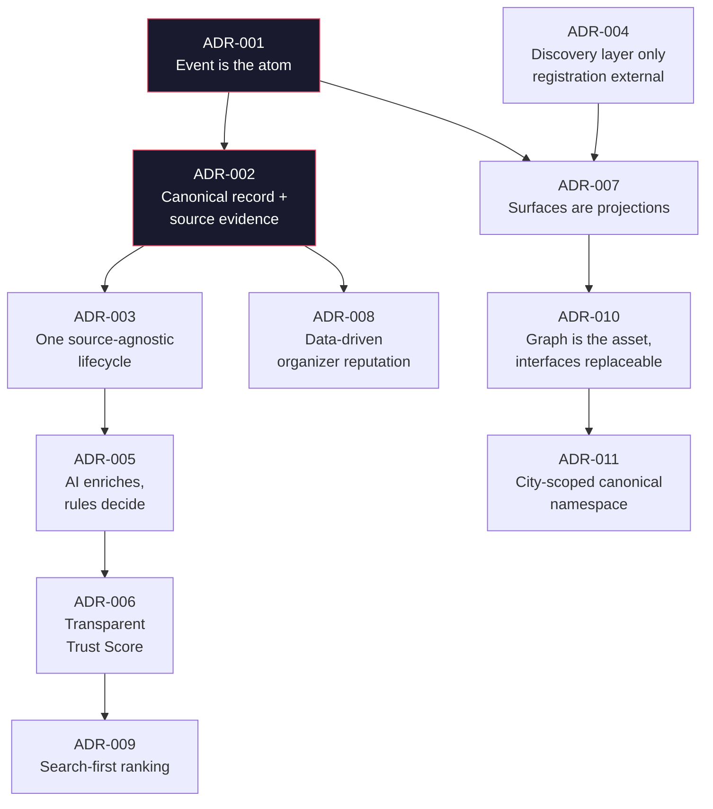

# 04 — Architecture Decision Record (ADR): Lucknow Event Hub

> **Panel authors:** Principal Software Architect (lead) · AI Platform Architect · Staff Backend Engineer · Principal Product Manager · Founder · UX Lead
> **Nature:** These are **conceptual, product-shaping decisions** — the load-bearing choices that define what kind of system this is. They are implementation-agnostic by design (no databases, frameworks, or infrastructure named). Technology selection is a later document.
> **Companion docs:** `02_Product_Vision.md`, `03_PRD.md`, `05_Domain_Model.md`

Each decision uses: **Status · Context · Decision · Consequences (＋/－/○) · Panel note.**

---

## Decision map

---

## ADR-001 — The Event is the atomic domain primitive

**Status:** Accepted (foundational)

**Context:** Everything users see — pages, cards, categories, calendars, feeds — could be modeled as independent artifacts, or all derived from one thing. Choosing the wrong atom leads to duplicated logic and drift between surfaces.

**Decision:** Model the domain around a single first-class primitive: the **Event**. Organizers, venues, categories, tags, trust, and every surface are *derived from* or *attached to* events. The Event is the noun the entire system is organized around.

**Consequences:**
- ＋ One place to reason about correctness; no surface can disagree with another.
- ＋ New surfaces are cheap — they are just new readers of the same atom.
- － Requires disciplined resistance to "just add a field/table for this page."
- ○ Forces early rigor in the domain model (`05`).

**Panel note (Founder + Architect):** This is the decision every other one depends on. If the event is not the atom, "single source of truth" is a slogan, not an architecture.

---

## ADR-002 — Canonical record with preserved source evidence

**Status:** Accepted (foundational)

**Context:** The same real-world event appears on many platforms. We can either keep N listings (aggregator model) or collapse to one truth (canonical model).

**Decision:** Maintain **exactly one canonical Event per real-world event**, with each originating source retained as **evidence** attached to that canonical record. Merging is a first-class, reversible operation — never destructive cleanup.

**Consequences:**
- ＋ Users see one trustworthy record; provenance is never lost.
- ＋ Enables trust and organizer reputation to be computed over clean, deduplicated history.
- － Requires robust deduplication and a merge/split capability with audit history.
- ○ "Which fields win when sources disagree?" becomes an explicit, ruled decision.

**Panel note (Staff Engineer):** The evidence set is what makes trust *explainable* — we can always show *where* a fact came from.

---

## ADR-003 — One source-agnostic ingestion lifecycle

**Status:** Accepted

**Context:** Sources vary wildly (scrapes, APIs, manual submissions, future email). The temptation is per-source pipelines. That path fragments logic and makes new sources expensive.

**Decision:** Define **one fixed lifecycle** that every event passes through regardless of origin (collect → extract → normalize → validate → deduplicate → enrich → trust → publish → index → archive). **Sources are pluggable adapters at the edge**; the lifecycle in the middle never branches on source identity.

**Consequences:**
- ＋ Adding a source is configuration, not re-architecture (fulfills a core vision principle).
- ＋ One place to improve quality benefits all sources at once.
- － Source-specific quirks must be absorbed at the adapter boundary, not leaked inward.
- ○ Requires a clean contract between "adapter output" and "lifecycle input."

**Panel note (Architect):** This is the decision that keeps V1 small while the source list grows without bound.

---

## ADR-004 — Discovery/intelligence layer only; registration stays external

**Status:** Accepted (strategic boundary)

**Context:** There is gravitational pull toward becoming a management/ticketing platform ("just add registration"). That would put us in direct competition with incumbents and dilute the moat.

**Decision:** The platform is **strictly a discovery and intelligence layer.** It never handles registration, ticketing, payments, or hosting. Every registration action redirects to the organizer's original platform.

**Consequences:**
- ＋ Zero conflict with the platforms we aggregate; they become our data sources, not rivals.
- ＋ Keeps scope tight; the moat (structured knowledge) compounds.
- － We forgo transactional revenue; monetization must come from intelligence/analytics.
- ○ Makes "valid registration link" a validation requirement rather than an internal feature.

**Panel note (Founder + PM):** The non-goals are the strategy. This decision is what makes them enforceable.

---

## ADR-005 — AI enriches; deterministic rules decide

**Status:** Accepted

**Context:** AI is essential for extraction and enrichment at scale, but AI making irreversible public decisions (what publishes, what merges) is both a trust risk and an explainability problem.

**Decision:** Draw a hard boundary: **AI produces structured suggestions and scores** (extraction, categorization, summaries, similarity, confidence). **Deterministic rules — and human stewards for edge cases — make the consequential decisions** (publish/reject, merge/split, trust threshold). Every AI-influenced outcome is explainable and overridable.

**Consequences:**
- ＋ Trust and safety: the city never sees a black-box verdict.
- ＋ AI models can be swapped/upgraded without changing decision semantics.
- － Requires designing explicit rule layers around AI outputs (more upfront design).
- ○ Confidence scores become first-class citizens feeding rules.

**Panel note (AI Platform Architect):** "Explainable AI" here is not a compliance checkbox — it is the mechanism that lets us *earn* the word canonical.

---

## ADR-006 — Transparent, rule-based Trust Score (quality, not popularity)

**Status:** Accepted

**Context:** "Which events are good?" must be answered without becoming a popularity contest or a pay-to-feature scheme, both of which erode trust.

**Decision:** Compute a **transparent Event Trust Score** from inspectable signals (completeness, freshness, link validity, dedup confidence, AI confidence, organizer reliability, verification). The methodology is public and explainable; **Featured selection is derived from objective rules**, never manual promotion or payment.

**Consequences:**
- ＋ The ranking layer is defensible and inspectable — a differentiator.
- ＋ Removes the temptation (and corruption risk) of paid placement.
- － Signals must be genuinely computable and kept honest over time.
- ○ Score weighting becomes a policy artifact stewards can tune transparently.

**Panel note (PM + UX Lead):** Users should be able to ask "why is this trusted / featured?" and get a real answer.

---

## ADR-007 — Every surface is a projection of the canonical event

**Status:** Accepted

**Context:** Given ADR-001/002, surfaces could still be authored independently. Doing so would reintroduce drift and manual work.

**Decision:** **No surface is manually authored.** Event pages, homepage cards, category/search pages, calendars, feeds, newsletters, and API responses are all **generated projections** of canonical events. Presentation is a read model over the truth.

**Consequences:**
- ＋ Consistency for free; a fact fixed once is fixed everywhere.
- ＋ New surfaces are additive and low-cost.
- － Presentation flexibility is constrained by what the canonical model expresses.
- ○ Encourages the domain model to capture presentation-relevant structure explicitly.

**Panel note (UX Lead):** Design freedom lives in the *projection templates*, not in bespoke per-page data.

---

## ADR-008 — Organizer reputation is data-driven and emergent

**Status:** Accepted (activates in V2)

**Context:** Reputation could be self-declared (organizers claim authority) or earned (derived from behavior). Self-declared reputation is gameable and untrustworthy.

**Decision:** Organizer profiles and reputation are **derived from the canonical event history** (reliability, freshness, completeness, historical accuracy), not from self-declared claims. An optional claim-and-verify flow adds identity, not authority.

**Consequences:**
- ＋ Reputation is credible because it is earned and computed.
- ＋ Creates a durable public identity layer as a side effect of good data.
- － Requires sufficient history before reputation is meaningful (cold start).
- ○ Ties reputation quality directly to dedup/trust quality.

**Panel note (Founder):** This is how we become the *identity layer* for the city's communities — by measuring, not by asking.

---

## ADR-009 — Search-first discovery; ranking is a product surface

**Status:** Accepted

**Context:** Discovery can be browse-first (long lists) or search-first (find-then-act). Browsing does not scale with coverage; the more canonical we are, the more search matters.

**Decision:** Treat **search as a primary product surface**, not a utility. Ranking blends **relevance × trust × freshness**, transparently, and evolves from keyword/filter (V1) to semantic/natural-language (V2+).

**Consequences:**
- ＋ Experience improves *as* coverage grows (search beats scroll at scale).
- ＋ Trust becomes an active ranking input, not just a badge.
- － Requires ranking to be explainable and continuously evaluated.
- ○ Elevates enrichment quality (categories/tags/summaries) as search fuel.

**Panel note (UX Lead + AI Platform Architect):** Semantic search is the bridge from "listings" to "intelligence."

---

## ADR-010 — The knowledge graph is the asset; interfaces are replaceable

**Status:** Accepted (strategic)

**Context:** It is tempting to equate the product with the website. That undervalues the real, durable asset.

**Decision:** Treat the **structured event knowledge graph** as the core asset and interfaces (web, mobile, API, assistant, newsletter, dashboards) as **interchangeable clients**. Investment prioritizes the graph's correctness, structure, and history over any single interface.

**Consequences:**
- ＋ Optionality: new surfaces and monetization (analytics, API) attach to the same asset.
- ＋ Long-term defensibility lives in accumulated structured history.
- － Requires resisting interface-driven shortcuts that corrupt the graph.
- ○ Justifies "documentation-first" and rigorous domain modeling.

**Panel note (Architect):** If we ever have to choose between a prettier page and a cleaner graph, we choose the graph.

---

## ADR-011 — City-scoped canonical namespace (federation-ready)

**Status:** Accepted (Lucknow now; federation is a later horizon)

**Context:** The mandate is Lucknow. But the model should not accidentally hard-wire assumptions that prevent extending the same pattern elsewhere.

**Decision:** Scope canonical uniqueness and relevance to a **city namespace** (Lucknow as the first). Keep city an explicit dimension of the model so the *same architecture* can host additional cities later without redesign — while V1 remains single-city and focused.

**Consequences:**
- ＋ Lucknow ships focused; the door to federation stays open at near-zero cost.
- ＋ Relevance, trust, and organizer reputation are naturally city-scoped.
- － Requires care that "city" is a first-class concept, not an afterthought field.
- ○ Aligns with the long-term "city ecosystem reports" and federation vision.

**Panel note (Founder + PM):** Design for many cities; ship one. Never let ambition slow V1, and never let V1 foreclose ambition.

> **⟳ Status update (Platform Evolution): Amended by ADR-012.** The strategic decision to become an open-source, multi-community platform promotes this from "federation is a later horizon" to "multi-deployment is the product." "City" generalizes to **Tenant**. See ADR-012 and `10_Architecture_Evolution.md`.

---

## ADR-012 — Tenant as the first-class deployment entity (amends ADR-011)

**Status:** Accepted *(Platform Evolution)*

**Context:** Deployments are no longer only cities — they include universities, startup communities, organizations, and countries. "City" is too narrow to be the namespace primitive.

**Decision:** Introduce **Tenant** as the first-class deployment/namespace entity, with a `type` (`city` | `campus` | `community` | `organization` | `country`). Every domain entity (events, organizers, venues, communities, sponsors, analytics, notifications) carries a `tenant_id`. "City" becomes a *type of tenant*, not the model root.

**Consequences:**
- ＋ One model serves any deployment shape without special-casing.
- ＋ Canonical uniqueness, relevance, trust, and reputation are all tenant-scoped and thus reusable.
- － Every entity and query gains a tenancy dimension; discipline required so it is never bypassed.
- ○ Reframes `05_Domain_Model.md` around Tenant (see its Platform-Evolution amendment).

**Panel note:** Generalize the noun once, at the root, so nothing downstream has to know whether it is serving a city or a campus.

---

## ADR-013 — Configuration over code (an instance is data, not a fork)

**Status:** Accepted *(Platform Evolution)*

**Context:** If standing up "Delhi" or "Campus X" requires editing source, the platform is not reusable and cannot be maintained across deployments.

**Decision:** A deployment is defined **entirely by an instance configuration** — branding, logo, colors, social links, domain, timezone, language(s), enabled features/modules, event sources, categories, themes, and provider selections. **No tenant-specific logic may exist in business code.** Adding or changing a deployment never modifies application source.

**Consequences:**
- ＋ New deployment = new config, not a fork; upgrades flow to all instances from one codebase.
- ＋ Non-developers can operate an instance.
- － Requires a rigorous, validated configuration schema and a config-loading layer (see `13_Instance_Configuration_Reference.md`).
- ○ Any hard-coded Lucknow assumption in V0 becomes technical debt to remove (audit finding).

**Panel note:** The test: could a stranger launch "Jaipur" this weekend with only a config file and provider keys? If not, we failed this ADR.

---

## ADR-014 — Plugin architecture (ports & adapters) for all external capabilities

**Status:** Accepted *(Platform Evolution)*

**Context:** Different deployments need different scrapers, AI providers, notification channels, auth systems, search backends, and analytics sinks. Hard dependencies on one implementation each would fork the platform per community.

**Decision:** Define **stable plugin interfaces (ports)** for: source/scraper adapters, AI providers, notification providers, authentication providers, search providers, analytics providers (and the already-abstracted storage provider). The core depends only on these contracts; concrete implementations are **plugins selected by configuration** and discovered via a registry. Each port ships with a **conformance test suite** a plugin must pass.

**Consequences:**
- ＋ Communities swap providers (e.g., Gemini → local model, email → WhatsApp) without touching core.
- ＋ Enables an external plugin ecosystem — the heart of OSS extensibility.
- － Interfaces must be versioned and kept stable; premature abstraction is a real risk (build a port only when ≥2 implementations or a clear need exists).
- ○ Codifies the existing `04-ADR-003` (source-agnostic) and `06 §13` (model gateway) into a general pattern. See `12_Plugin_Development_Guide.md`.

**Panel note:** Abstract at the boundary, never in the middle. A port earns its existence when a second implementation appears — not before.

---

## ADR-015 — Dual deployment mode: single-tenant self-host + multi-tenant hosted, one codebase

**Status:** Accepted *(Platform Evolution)*

**Context:** Two audiences: (a) a community that self-hosts its own single instance, and (b) an operator (e.g., UPAI Labs) hosting many communities from one deployment. Building two codebases would be unmaintainable.

**Decision:** **One codebase, two runtime modes.** Data model is **shared-schema, row-level multi-tenant** with a `tenant_id` on every table and **Row-Level Security** as the isolation backstop; the active tenant is resolved per request (by domain/subdomain, or fixed via config in single-tenant mode). A self-hoster simply runs with **one tenant**; a hosted operator runs with **many**. Same code, same migrations.

**Consequences:**
- ＋ Self-host and SaaS are the same product; federation is near-free (a new tenant is config + a domain, not a deploy).
- ＋ Cheaper isolation than database-per-tenant; simpler ops than schema-per-tenant.
- － RLS discipline is mandatory; a missing policy is a cross-tenant leak. Requires tenant-context middleware and tests.
- ○ Chosen over database-per-tenant (heavy self-host ops) and schema-per-tenant (migration sprawl). See `11_Multi_Tenant_Architecture.md`.

**Panel note:** The single-tenant self-hoster must never pay the complexity tax of multi-tenancy — it should feel like a normal app that happens to have one tenant.

---

## ADR-016 — Open-source core + community plugin ecosystem

**Status:** Accepted *(Platform Evolution)*

**Context:** The durable asset (ADR-010) is the knowledge graph and the *platform*. To be adopted and to survive its maintainers, the platform must be genuinely open-source-native.

**Decision:** Ship as an **open-source platform** with a clear separation between **core** (domain, lifecycle, ports), **official plugins**, **community plugins**, and **deployment configs**. Provide contribution workflow, semantic versioning (core *and* plugin-API versions), conformance-tested plugin SDK, documented config schema, and one-command deployment. License permissively enough to encourage deployment and contribution.

**Consequences:**
- ＋ Extensibility, longevity, contributor leverage; reduces bus-factor risk flagged in `08`.
- ＋ Communities can maintain their own plugins/sources without upstream bottleneck.
- － Real maintainer burden: reviews, versioning discipline, docs, support — must be resourced or it rots (an `08` risk, amplified).
- ○ Governs `13`, `12`, and the new contribution guide (`14`).

**Panel note:** Open source is a commitment, not a license file. If nobody can contribute a plugin without our help, we have a public repo, not an open-source platform.

---

## Cross-cutting principles enforced by these decisions

| Principle (from `02`) | Enforced by |
|---|---|
| Event-centric domain model | ADR-001 |
| Single source of truth | ADR-001, ADR-002 |
| Source-agnostic ingestion | ADR-003 |
| Discovery layer, not management | ADR-004 |
| Explainable AI | ADR-005 |
| Transparent scoring & ranking | ADR-006, ADR-009 |
| Automation over manual work | ADR-007 |
| Data-driven reputation | ADR-008 |
| Search-first UX | ADR-009 |
| Graph as the durable asset | ADR-010 |
| Scalable / extensible | ADR-003, ADR-011, ADR-014 |
| Tenant as deployment boundary *(new)* | ADR-012, ADR-015 |
| Configuration over code *(new)* | ADR-013 |
| Everything pluggable *(new)* | ADR-014 |
| Open-source by default *(new)* | ADR-016 |

---

## Panel closing note

These eleven decisions are deliberately **about product shape, not technology.** Any competent team could implement them on many stacks. What must not change across implementations is the *shape*: one event atom, one canonical truth with evidence, one lifecycle for all sources, AI that enriches but never decides alone, transparent trust, generated surfaces, and a graph that outlives every interface.
