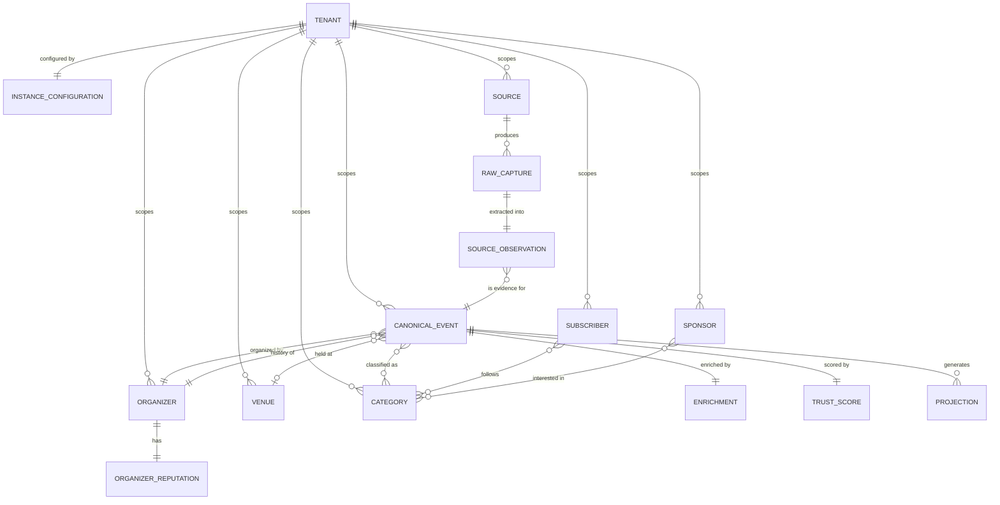
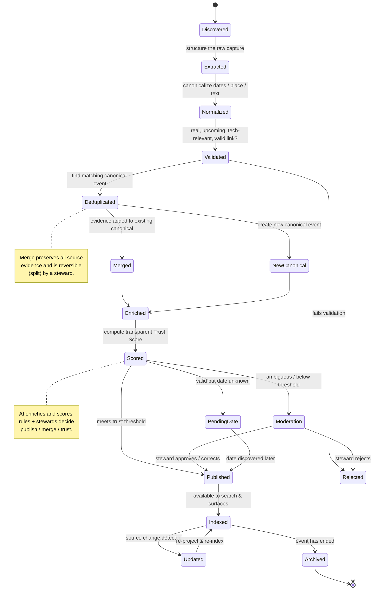
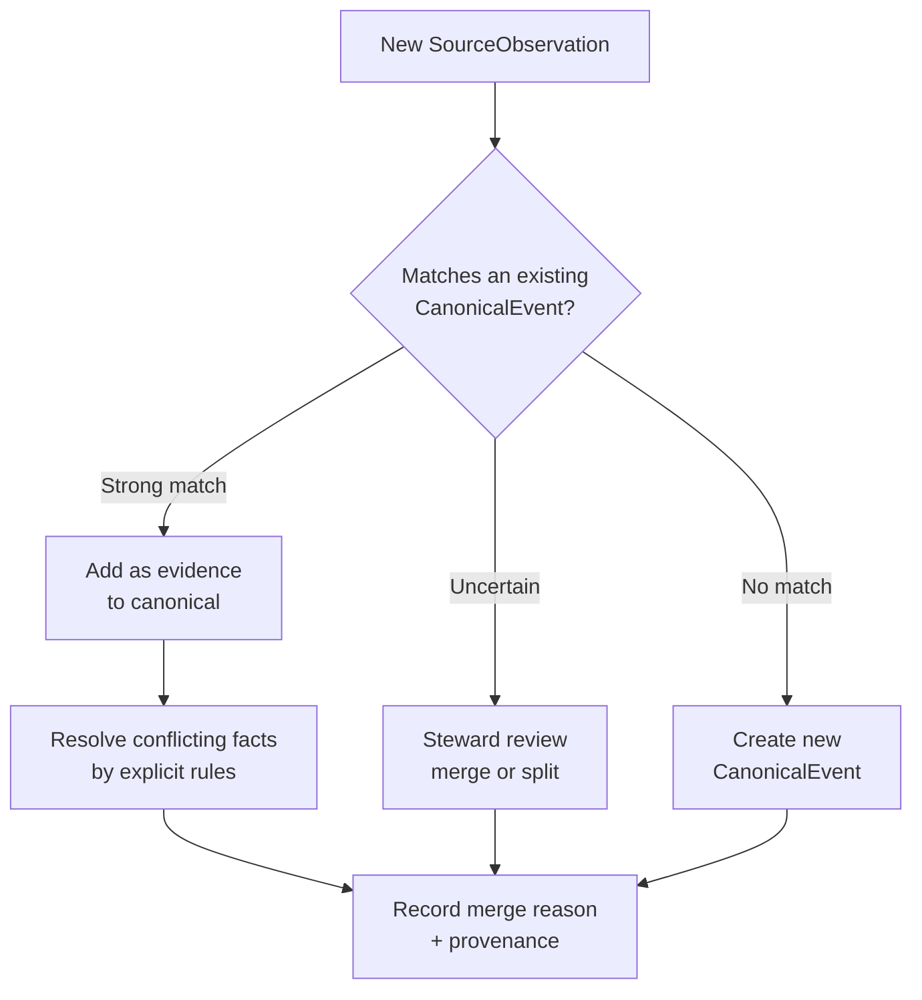
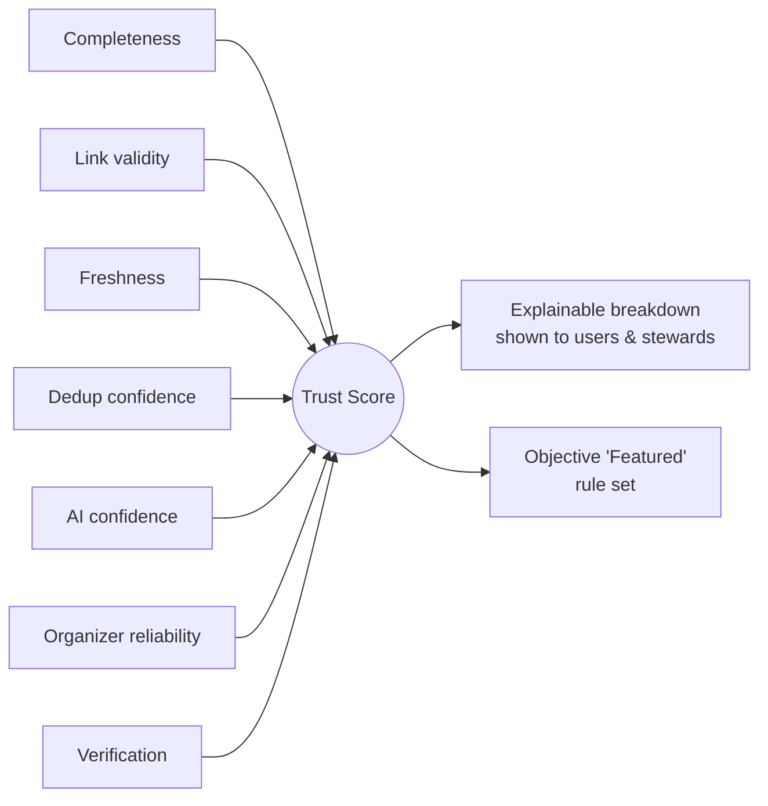
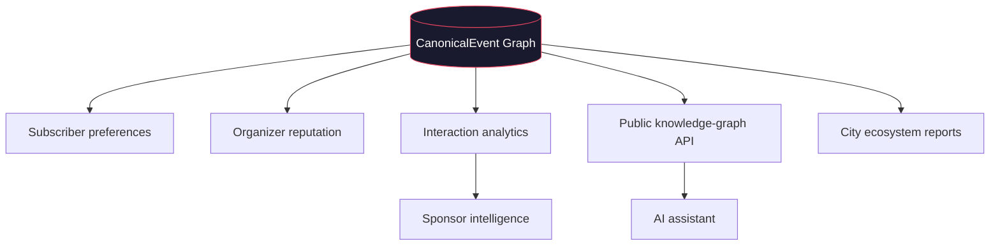

# 05 — Domain Model: City Event Hub Platform

> **Panel authors:** Staff Backend Engineer (lead) · Principal Software Architect · AI Platform Architect · Principal Product Manager · Founder · UX Lead
> **Nature:** A **conceptual** domain model — entities, relationships, lifecycle, and invariants. It defines the *shape of the truth*, not its storage. No database or technology decisions here.
> **Companion docs:** `02_Product_Vision.md`, `03_PRD.md`, `04_Architecture_Decision_Record.md`, `11_Multi_Tenant_Architecture.md`, `13_Instance_Configuration_Reference.md`
> **⟳ Evolved (Platform Evolution):** **`City` is generalized to `Tenant`** (first-class deployment entity, per ADR-012). Every entity is now **tenant-scoped**. Amended sections: 1 (stance), 2 (entities), 3 (ER), 9 (invariants), 10 (future), 11 (glossary). The event-atom model (ADR-001/002) is unchanged — it now simply lives *within a tenant*.

---

## 1. Modeling stance

Per **ADR-001** and **ADR-002**, the domain is organized around a single atom — the **Canonical Event** — with every real-world origin retained as **evidence**. All other entities either *describe*, *classify*, *attach to*, or are *derived from* events.

**Tenancy overlay (ADR-012/015):** the entire model lives **inside a Tenant** — the deployment/namespace entity (a city, campus, community, organization, or country). Every entity below carries a `tenant_id`; canonical uniqueness, relevance, trust, and reputation are all **tenant-scoped**. A single-tenant self-host is simply the case of one Tenant; a hosted operator runs many. The Tenant also *owns its configuration* (branding, sources, providers, features — see `13_Instance_Configuration_Reference.md`), realizing "configuration over code" (ADR-013) at the domain level.

This section is the authoritative vocabulary the rest of the system speaks.

---

## 2. Core entities (conceptual)

| Entity | Role | Nature |
|---|---|---|
| **Tenant** *(new; root scope)* | A deployment/namespace: city, campus, community, organization, or country. Owns all data and its own configuration. | Scope root |
| **InstanceConfiguration** *(new)* | The tenant's config bundle: branding, domain, timezone, languages, enabled features/modules, sources, categories, provider selections. | Config (data) |
| **CanonicalEvent** | The single source of truth for one real-world event. | Primary atom |
| **SourceObservation** | One sighting of an event from one source (the evidence). | Provenance |
| **Source** | A configured origin (site, platform, API, submission channel). | Ingestion edge |
| **RawCapture** | The unstructured payload captured from a source before extraction. | Raw input |
| **Organizer** | The community/company/individual running the event. | Attached / derived |
| **Venue** | Physical or virtual location. | Attached |
| **Taxonomy** (Category, Tag, Audience, Format) | Classification of the event. | Attached / AI-generated |
| **Enrichment** | AI-generated metadata bundle (summary, tags, category, scores). | Derived (AI) |
| **TrustScore** | Transparent, signal-based quality/reliability score. | Derived (rules) |
| **OrganizerReputation** | Data-driven reputation computed from event history. | Derived (V2) |
| ~~**City**~~ → **Tenant** | *Generalized (ADR-012).* City is now a Tenant of `type = city`. | Scope root (see above) |
| **Subscriber** | An end user who follows/searches/receives notifications. | V2 |
| **Sponsor** | An ecosystem partner consuming analytics. | V3 |
| **Projection** | A generated surface (page, card, calendar entry, feed item). | Read model |

---

## 3. Entity relationships

> **Note:** `TENANT` is the root of every relationship chain. Categories, taxonomy, sources, sponsors, and subscribers are all tenant-scoped — a Delhi deployment's categories/sources/sponsors are entirely separate from Lucknow's, from the same schema (ADR-015 shared-schema RLS). Cross-entity relationships (event↔organizer↔venue) are implicitly *within a single tenant*.

**Reading the key relationships:**
- A **CanonicalEvent** aggregates one-or-more **SourceObservations** — this is the merge-not-duplicate rule (ADR-002) expressed structurally.
- **Organizer**, **Venue**, and **Taxonomy** attach to the canonical event; **Enrichment** and **TrustScore** are *derived* from it.
- **Projections** (pages, cards, calendar entries, feeds) are generated read models — never authored (ADR-007).
- **OrganizerReputation** is derived from the organizer's event history (ADR-008).
- **City** scopes canonical uniqueness and relevance (ADR-011).

---

## 4. CanonicalEvent — attribute groups (conceptual)

Described by meaning, not storage type.

- **Identity & scope:** canonical id, city, canonical slug/handle (generated), lifecycle state.
- **Core facts:** title, start datetime, end datetime, timezone, mode (offline/online/hybrid), date-known vs date-pending.
- **Place:** venue reference, locality, address (for offline/hybrid).
- **People:** organizer reference, community/co-organizers.
- **Access:** canonical URL, registration URL (external — ADR-004), price nature (free/paid/unknown), student-friendly flag.
- **Classification (derived):** categories, tags, audience level, format.
- **Narrative (derived):** short summary, description.
- **Quality (derived):** trust score + signal breakdown, completeness, freshness timestamp.
- **Provenance:** the set of SourceObservations that support this record, with "which fact came from which source."
- **Lifecycle timestamps:** discovered, published, last-updated, archived.

**Conflict resolution:** when observations disagree on a fact, resolution is an explicit, ruled decision (e.g., prefer higher-trust source, prefer freshest, prefer most complete) — and the winning provenance is retained so trust remains explainable.

---

## 5. Event lifecycle (state machine)

Per **ADR-003**, every event — from any source — traverses the *same* states.

**Lifecycle invariants:**
- No state transition into **Published** without passing **Validated** and meeting the **Trust** threshold (ADR-005/006).
- **Merged** never destroys evidence; it is reversible (ADR-002).
- **PendingDate** events are valid but held out of date-dependent surfaces (e.g., calendar) until resolved.
- **Archived** events remain in the graph to power organizer history and analytics (they never vanish).

---

## 6. Deduplication & canonicalization model

The heart of "single source of truth." Deduplication answers: *are these two observations the same real-world event?*

**Similarity signals (conceptual, combined — not any single one alone):** title similarity, date proximity, time, venue, organizer identity, registration/canonical URL, and an AI similarity score. **Precision is prioritized over recall** — a wrong merge (two real events collapsed into one) is more damaging than a missed merge, so uncertain cases go to review rather than auto-merge.

---

## 7. Trust Score model (transparent by construction)

Per **ADR-006**, trust is a **function of inspectable signals**, expressing reliability — not popularity. The model is a transparent, explainable aggregation; exact weights are a tunable policy artifact owned by stewards, not a hidden constant.

| Signal | Question it answers |
|---|---|
| Information completeness | Are the core facts (date, place/mode, organizer, link) present? |
| Registration link validity | Does the outbound link actually work? |
| Freshness | Was this confirmed/updated recently? |
| Deduplication confidence | Are we confident this is one clean canonical record? |
| AI extraction confidence | How reliable was the structured extraction? |
| Organizer reliability (V2) | Has this organizer historically been accurate? |
| Verification | Is the organizer/venue verified? |

**Rules:** Trust gates publishing (below threshold → moderation) and feeds ranking (ADR-009). **Featured** is a pure function of trust + freshness + completeness — never manual or paid.

---

## 8. Organizer reputation model (V2)

Reputation is **emergent from event history** (ADR-008), never self-declared.

- **Inputs:** historical event completeness, historical link validity, freshness/consistency, dedup cleanliness, verification status, longevity/volume of reliable events.
- **Outputs:** a public reputation indicator + an organizer profile (upcoming/past events, categories, links).
- **Cold start:** new organizers begin neutral; reputation accrues as reliable history accumulates.

---

## 9. Domain invariants (must always hold)

1. **Exactly one CanonicalEvent per real-world event**, **per tenant**.
2. **Every CanonicalEvent has ≥1 SourceObservation** (nothing exists without provenance).
3. **A published event has a valid, external registration/canonical link** (never internal registration).
4. **Trust Score is always explainable** by its signal breakdown.
5. **AI never solely decides** publish / merge / trust — rules or stewards do.
6. **Merges are reversible** and preserve all evidence.
7. **All surfaces are projections** of a CanonicalEvent — none are authored.
8. **Classification is derived** (AI/rules), not required from organizers.
9. **Tenant is an explicit dimension** on *every* entity; canonical identity and relevance are tenant-scoped. *(generalized from "City", ADR-012)*
10. **Archived events persist** to power history, reputation, and analytics.
11. **No entity or query crosses tenant boundaries** without an explicit cross-tenant operation; tenant isolation is enforced at the data layer (ADR-015 RLS). *(new)*
12. **A tenant's behavior is fully determined by its InstanceConfiguration** — no tenant-specific branching in business logic (ADR-013). *(new)*

---

## 10. Future entities (roadmap-aligned)

| Entity | Version | Purpose |
|---|---|---|
| **Subscriber** + follows/preferences | V2 | Notifications, digests, personalization |
| **OrganizerReputation** | V2 | Data-driven credibility |
| **Interaction / AnalyticsSignal** | V2 | Views, clicks, search behavior → analytics |
| **Sponsor** + interest graph | V3 | Ecosystem intelligence consumers |
| **KnowledgeGraphNode/Edge** (explicit) | V3 | Public API + assistant over the graph |
| **CityReport** | V3 | Periodic ecosystem reporting |
| **Additional City** namespaces | V3 | Federation of the same model |

---

## 11. Glossary

- **CanonicalEvent** — the single authoritative record for one real-world event.
- **SourceObservation** — one piece of evidence for a canonical event, from one source.
- **Source** — a configured ingestion origin.
- **RawCapture** — the unstructured payload before extraction.
- **Enrichment** — AI-generated metadata (summary, tags, category, scores).
- **TrustScore** — transparent, signal-based reliability score.
- **Projection** — an auto-generated surface (page, card, calendar entry, feed) over a canonical event.
- **Steward** — a human operator who sets policy and resolves edge cases (never does data entry).
- **Tenant** *(new)* — the root deployment/namespace entity (a city, campus, community, organization, or country) that scopes all data and owns its configuration.
- **InstanceConfiguration** *(new)* — the data bundle that fully defines a tenant's behavior and appearance (branding, domain, timezone, languages, features, sources, categories, providers).
- **City** — a **Tenant of `type = city`** (no longer the model root; retained as a tenant type).
- **Reputation** — data-driven organizer credibility derived from event history.

---

## Panel closing note

This model is the **contract** that makes the vision and the ADRs concrete without prematurely choosing technology. The **Staff Engineer** and **Architect** guarantee its rigor; the **AI Platform Architect** keeps enrichment and trust explainable within it; the **PM** and **UX Lead** ensure it captures what surfaces need; the **Founder** ensures it can grow into the city's knowledge graph. Build any implementation you like on top — but keep this shape intact, because this shape *is* the product.
