# 06 — System Architecture: City Event Hub Platform

> **Panel authors:** Google Staff Engineer · Uber Infrastructure Engineer · Cloud Solution Architect · AI Platform Architect · System Design Interviewer
> **Inputs:** `01_Project_Audit.md` (V0 reality) · `02_Product_Vision.md` · `03_PRD.md` · `04_ADR.md` · `05_Domain_Model.md`
> **Purpose:** The production, technology-concrete architecture. Every decision is justified against alternatives and against *actual* load — not against an imagined hyperscale.
>
> **⟳ Evolved (Platform Evolution) — amendments (details in the referenced new docs, so this large document stays stable):**
> - **§2/§3 Containers & Components** gain a **Tenant-Resolution middleware** (domain/subdomain → tenant context) and a **Plugin Registry**. The Model Gateway (§13) is now the *reference implementation* of the general **AI-provider port** (ADR-014). Full multi-tenant request path, isolation, and tenant lifecycle: **`11_Multi_Tenant_Architecture.md`**.
> - **§7 Database Design** — every table gains `tenant_id`; **Row-Level Security** enforces isolation (shared-schema multi-tenancy, ADR-015). The `UNIQUE(city_id, …)` constraints generalize to `UNIQUE(tenant_id, …)`.
> - **§13 AI Pipeline / §12 Search / §9 Queue / §16 Analytics / §18 Logging** — the provider abstractions become **formal plugin ports** (AI, search, notification, auth, analytics, scraper, storage): **`12_Plugin_Development_Guide.md`**.
> - **§23 Configuration Strategy** is superseded/expanded by the full instance-config schema in **`13_Instance_Configuration_Reference.md`** (branding, domain, timezone, languages, features, sources, categories, providers). "Single source of truth per setting" now means *per tenant, from config*.
> - **§5 Deployment / §24 Scalability** add the **dual deployment mode** (single-tenant self-host vs multi-tenant hosted) — same codebase, same migrations. Caching, queues, and cache keys are **tenant-prefixed**.
> - **Unchanged:** the workload-sizing thesis (§0), read/write asymmetry, and all subsystem *mechanics*. Multi-tenancy raises no new scale problem at this volume; it is an isolation and configuration concern, not a throughput one.

---

## 0. Architectural thesis (read this first)

> **A modular monolith Core API + an asynchronous ingestion/enrichment worker plane + a hybrid search read model, over PostgreSQL (with pgvector), Redis, a durable queue, and object storage — fronted by a CDN/edge read layer. Microservices are deferred until specific seams (AI pipeline, search) prove they need independent scaling.**

The System Design Interviewer's discipline drives this document: **clarify the scale, justify from the load, name the bottleneck, design for evolution.** We do exactly that.

### 0.1 Scale & workload assumptions (the numbers that justify everything)

| Dimension | Estimate | Implication |
|---|---|---|
| New real events / month (Lucknow) | ~50–300 | **Writes are tiny.** Ingestion is not a throughput problem; it's a *correctness & cost* problem. |
| Source observations / month | ~1k–10k (dedupe to canonical) | Pipeline volume is modest; heavy cost is AI + rendering, not DB writes. |
| Published live events at any time | ~hundreds | Entire hot dataset fits in memory/cache trivially. |
| Read traffic (steady) | low-to-moderate | Easily served by cache + one primary. |
| Read traffic (spike: fest season, viral post) | 10–100× steady, **read-only** | **CDN absorbs it.** No transactional write spike exists (registration is external — ADR-004). |
| Federation horizon (multi-city) | 3–10 cities in 3–5 yrs | Multiply the above by ≤10. Still small. |

**The single most important architectural fact:** this is a **read-heavy, write-light, spike-on-reads-only** system. Registration lives elsewhere, so there is no write-hot path to protect. This asymmetry is the lever behind nearly every decision below.

> **Panel consensus (Uber Infra + Google Staff):** The failure mode here is not "can't handle load." It is **silent ingestion decay** (pipeline stops, quota exhausts, data goes stale) and **data-trust erosion**. We architect for *operational visibility and correctness*, not for QPS we'll never see.

---

## 1. Context Diagram (C4 — Level 1)

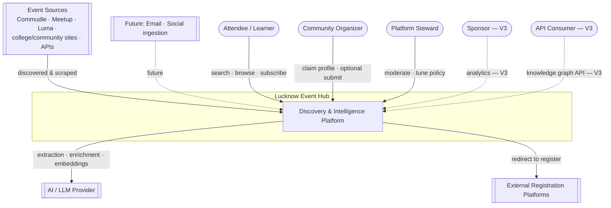

**Why this boundary:** The system consumes from sources and an AI provider, serves discovery to humans/agents, and *hands off* to external registration. This visualizes ADR-004 (we are a layer, not a destination for transactions).

---

## 2. Container Diagram (C4 — Level 2)

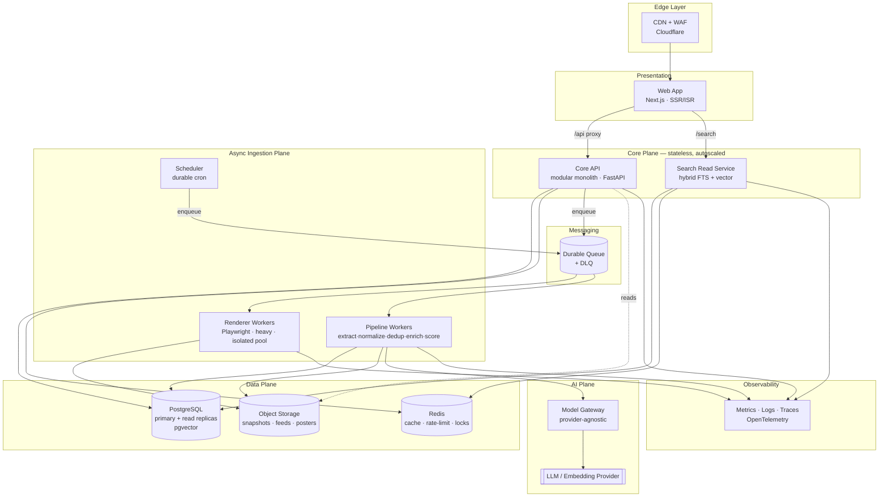

**Why these containers (and not more):**

| Container | Why it exists | Why *separate* from the monolith |
|---|---|---|
| **CDN + WAF** | Absorbs read spikes; WAF/bot protection for a public site. | Edge is inherently separate; it's where 90%+ of reads terminate. |
| **Web App (Next.js)** | SSR/ISR for SEO (discovery is SEO-critical) + fast pages. | Different runtime/scaling from the API; already the repo's shape. |
| **Core API (modular monolith)** | One deployable owning all bounded contexts behind clean module seams. | *Not* split — see §6. At this scale, one deployable is simpler and faster. |
| **Search Read Service** | Search is a *primary* feature (ADR-009) with distinct read patterns and (later) its own scaling curve. | First extraction candidate: its query load and index refresh cadence differ from CRUD. In V1 it can be a module; the seam is drawn now. |
| **Renderer Workers (isolated)** | Playwright/Chromium is heavy (CPU/RAM, cold starts). | **Must** be isolated so a rendering storm never starves light tasks or the API. The audit showed Playwright bundled into the API image — corrected here. |
| **Pipeline Workers** | Run the async event lifecycle. | Async, retryable, autoscaled independently of request traffic. |
| **Scheduler (durable)** | Triggers discovery, recrawl, expiry, recompute. | Must be reliable & leader-elected — the audit found the pipeline had *no committed prod runtime*. This is the fix. |
| **Durable Queue + DLQ** | Decouples ingestion, provides retries & backpressure. | Buffer between bursty discovery and rate-limited AI/rendering. |
| **PostgreSQL (+pgvector)** | One store for canonical graph, FTS, and vectors. | See §7 — deliberately *one* database. |
| **Redis** | Cache, distributed rate limiting, locks. | Shared low-latency state. |
| **Object storage** | Raw snapshots, materialized feeds, posters. | Cheap, durable, CDN-frontable blobs. |
| **Model Gateway** | Provider-agnostic AI access, batching, caching, guardrails. | Isolates the volatile part (models change monthly — the audit found four model strings). |

---

## 3. Component Diagram (C4 — Level 3): inside the Core API

The monolith is internally organized as **bounded contexts** matching `05_Domain_Model.md`. Each is a module with an explicit interface — an extraction seam.

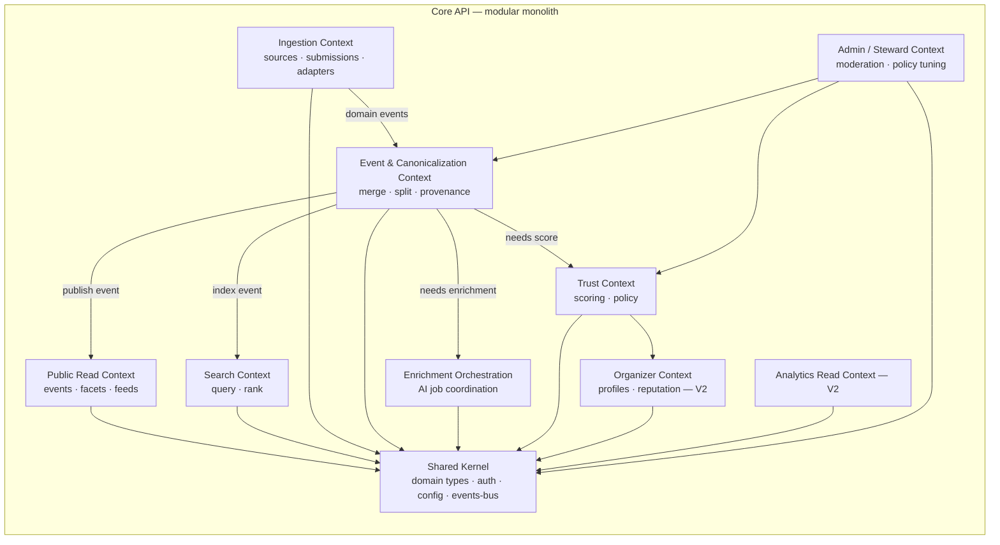

**Why bounded contexts inside one process:** We get **microservice-grade modularity** (clear ownership, testable seams, enforced dependencies) with **monolith-grade simplicity** (one deploy, one transaction boundary, no distributed-systems tax). Contexts communicate via an in-process **domain event bus**; the day a context needs independent scaling, the same events become queue messages and it extracts cleanly.

---

## 4. Sequence Diagrams

### 4.1 Ingestion — source to published (the core write path)

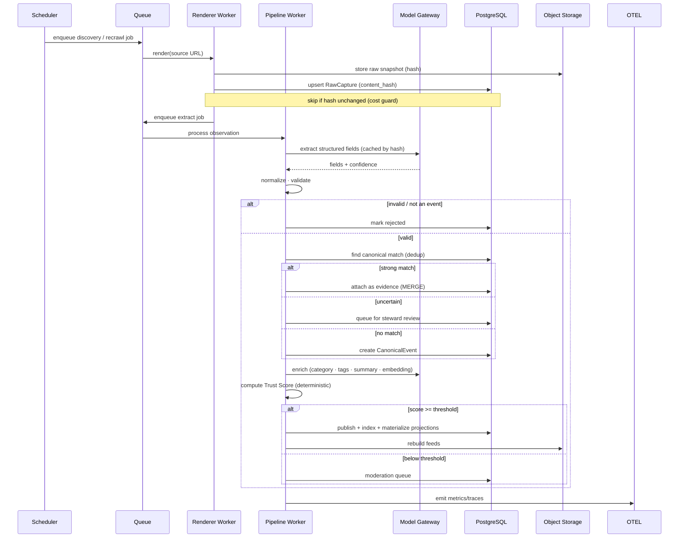

**Why async + idempotent stages:** discovery is bursty and AI/rendering are rate-limited and expensive. A queue gives **backpressure, retries, and cost control**. Every stage is **idempotent** (keyed by content hash + canonical URL) so retries and duplicate deliveries are safe — directly fixing the audit's race-condition/double-insert finding.

### 4.2 Public read — search request (the hot path)

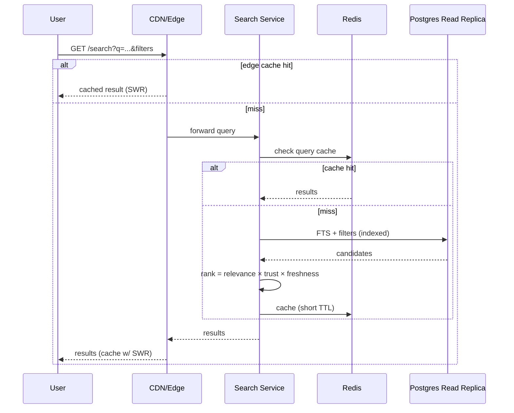

**Why three cache layers on reads:** the workload is read-dominant and spiky. Edge cache handles the spike; Redis handles warm repeat queries; the replica handles the long tail — the primary is never touched by public reads. This is how a 100× fest-season spike costs us nothing.

### 4.3 Hybrid semantic search (V2)

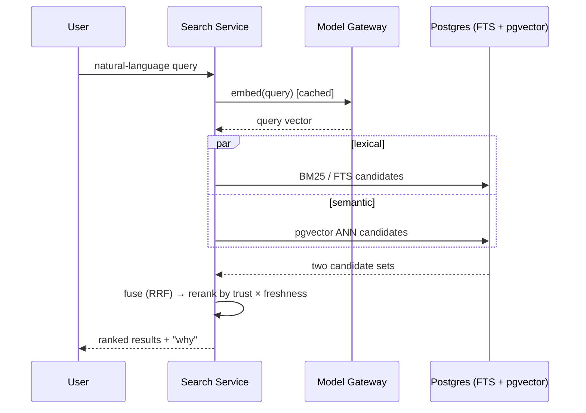

**Why hybrid (lexical + vector) rather than pure vector:** pure semantic search misses exact matches (event names, organizer names); pure lexical misses intent. **Reciprocal Rank Fusion** of both, reranked by trust/freshness, is the known-good pattern and keeps ranking **explainable** (ADR-009).

### 4.4 Source change → canonical update → re-publish

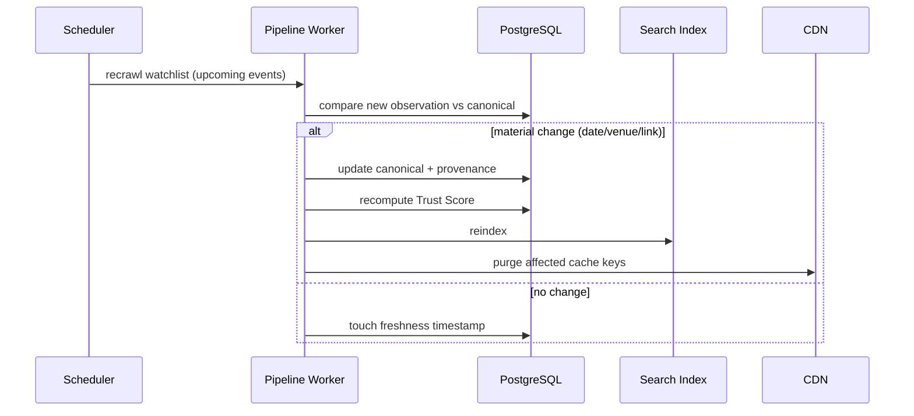

**Why explicit freshness + purge:** trust depends on freshness; stale data is the trust-killer. Detecting change → recompute → reindex → **purge** keeps every surface consistent (ADR-007).

---

## 5. Deployment Diagram

Recommended **managed, containerized** topology — cloud-portable, budget-aware (this is a community nonprofit, so we favor managed services over self-hosted ops). Region: **Mumbai (`ap-south-1` / `asia-south1`)** for latency to Lucknow users.

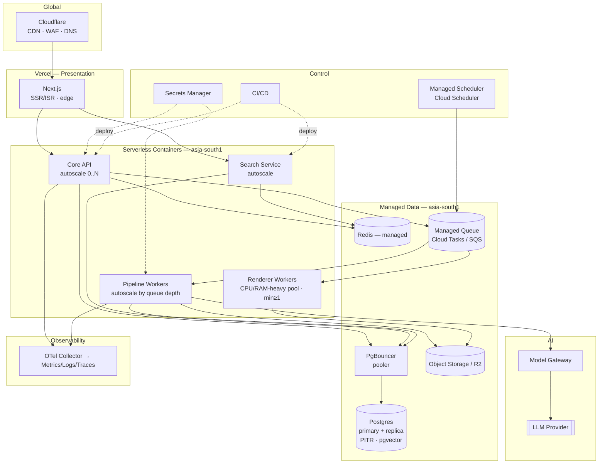

**Why serverless containers (Cloud Run-style) for the stateless plane:** scale-to-N on demand, pay for use, no cluster to operate — ideal for a small team and a spiky read profile. **Why renderers keep `min≥1`:** Playwright cold starts are brutal; a warm floor avoids latency cliffs. **Why managed everything else:** the team's scarce hours belong on data quality and product, not on operating Postgres/Redis/queues.

**Portability note:** every box is a container or a managed primitive with equivalents on GCP/AWS/Azure. Nothing here is single-vendor-locked; the model gateway similarly de-risks the AI provider.

---

## 6. Monolith vs Microservices — the boundary decision

**Decision: modular monolith Core API now; extract services only on proven triggers.**

**Why monolith now (the System Design Interviewer's favorite trade-off):**
- Write volume is tiny; there is no per-service scaling pressure to relieve.
- One transaction boundary makes **canonicalization/merge correctness** (the hard part) far simpler than a distributed saga.
- A 2–5 person team ships and debugs one deployable dramatically faster.
- Microservices would add network latency, partial-failure handling, and ops burden to buy scaling we don't need — a textbook premature-optimization.

**Why bounded contexts anyway:** we get the modularity benefit (ownership, testability, enforced dependencies) *without* the distributed tax, and we pre-draw the extraction seams.

**Extraction triggers (extract a service only when true):**

| Candidate service | Extract when… | Why it's first |
|---|---|---|
| **Search Service** | query QPS or index refresh cost interferes with API latency; or we adopt a dedicated engine (OpenSearch). | Distinct read pattern & scaling curve. |
| **AI/Enrichment Service** | AI concurrency/cost needs independent autoscaling & isolation. | Rate-limited, bursty, expensive. |
| **Renderer plane** | already isolated (heavy, unsafe to co-locate). | Resource profile + SSRF blast-radius. |
| **Analytics** | analytical queries threaten OLTP; volume grows. | OLAP ≠ OLTP (see §16). |

---

## 7. Database Design

**Decision: PostgreSQL as the single primary datastore** — canonical graph, provenance, full-text search, and vector embeddings, all in one engine.

### 7.1 Why one Postgres (and not a graph DB, not polyglot-from-day-one)

The vision says "knowledge graph." That is a *conceptual* model (`05`), not a mandate for a graph database.

- **Why not Neo4j/graph DB:** our "graph" is shallow (event→organizer→venue→category). Postgres handles these joins trivially at our scale. A graph DB adds an operational system to learn and run for a query pattern relational already serves. **Revisit only** if V3 relationship traversal (multi-hop recommendation/sponsor intelligence) becomes a real query bottleneck.
- **Why not Elasticsearch in V1:** Postgres FTS (tsvector + GIN) + `pg_trgm` covers keyword/filter/fuzzy search at hundreds-of-events scale. Running ES is a second stateful system for search we don't yet need. **Trigger to adopt:** corpus/traffic outgrows PG FTS, or ranking sophistication demands it.
- **Why pgvector, not a dedicated vector DB:** embeddings for hundreds–thousands of events are tiny; `pgvector` ANN indexes (HNSW) keep vectors *next to* the canonical data, enabling single-query hybrid search with no sync problem. **Trigger:** millions of vectors or specialized ANN needs.

> **Panel principle:** *One database until a specific, measured pain forces a second.* Every extra datastore is an extra thing to back up, secure, monitor, and keep consistent.

### 7.2 Schema shape (aligned to `05_Domain_Model`)

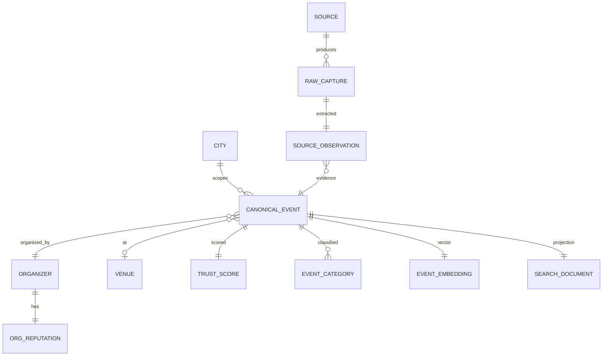

Key design choices and **why**:

| Choice | Why |
|---|---|
| `canonical_event` with **nullable `start_at`** + `date_status` enum | Fixes the audit's sentinel-date hack; TBA is a real state, not a fake 2027 date. |
| **`source_observation`** as separate evidence rows (not columns) | Merge-not-duplicate (ADR-002); provenance per fact; reversible merges. |
| `UNIQUE(city_id, canonical_url)` + `UNIQUE(city_id, slug)` | DB-level idempotency backstop the audit found missing; dedup can't double-insert. |
| **`trust_score` with JSONB signal breakdown + `policy_version`** | Transparent & explainable (ADR-006); recompute is versioned. |
| `search_document` **materialized projection** | Denormalized read model → fast search, no runtime joins (ADR-007). |
| `event_embedding` (pgvector, HNSW) | Semantic search co-located with data. |
| **Partition/archive**: archived events to a partition | Keeps the hot table small; archived data still queryable for history/analytics. |
| Read replicas | All public reads hit replicas; primary reserved for the light write path. |
| **PgBouncer (transaction pooling)** | Fixes the audit's `NullPool` (new connection per request) — a real scalability ceiling. |

---

## 8. Caching

**Layered, invalidate-on-publish.**

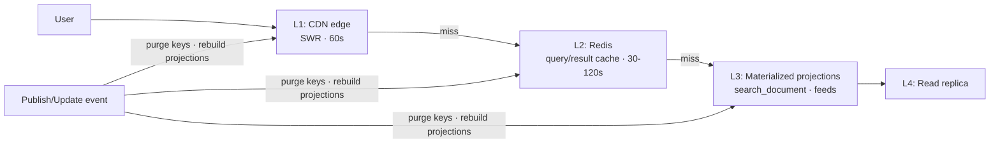

| Layer | Holds | TTL / invalidation | Why |
|---|---|---|---|
| L1 CDN | full read responses, feeds, event pages (ISR) | 60s + stale-while-revalidate; on-demand purge on publish | Absorbs spikes; nearest to user. |
| L2 Redis | query results keyed by normalized filters | 30–120s; explicit bust on publish | Warm repeat queries; protects replicas. |
| L3 Projections | `search_document`, JSON/ICS feeds | rebuilt on publish/update | No runtime joins; consistent surfaces. |
| L4 Replica | everything else | — | Long-tail reads off the primary. |

**Why event-driven invalidation over pure TTL:** correctness. When an event's date changes, users must not see stale info; publish/update **purges** exactly the affected keys and rebuilds projections, so freshness ≠ waiting for a TTL.

---

## 9. Queue Architecture

**Decision: a durable message queue with per-weight lanes and a DLQ.**

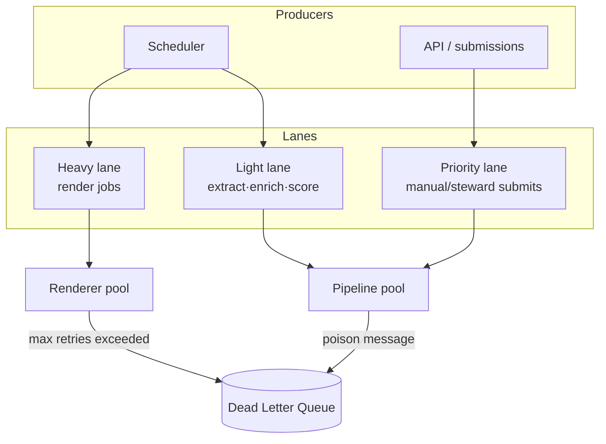

**Why separate lanes:** a burst of slow renders must not block fast enrichment or a steward's priority submission (head-of-line blocking). **Why a DLQ:** poison messages (a site that always fails to render) must not retry forever or block the lane — they park in the DLQ for inspection. **Why start on Redis-backed Celery, evolve to a managed queue (Cloud Tasks/SQS):** Celery is already in the codebase and fine at V1 volume; a managed queue buys durability/visibility/at-least-once guarantees when reliability needs grow. **Idempotency everywhere** (content-hash + canonical-url keys) makes at-least-once delivery safe.

---

## 10. Background Workers

| Pool | Work | Scaling signal | Isolation reason |
|---|---|---|---|
| **Renderer** | Playwright page rendering | queue depth of heavy lane | CPU/RAM-heavy, slow, SSRF-exposed → strict isolation & egress controls. |
| **Pipeline** | extract → normalize → validate → dedup → enrich → score → publish | queue depth of light lane | fast, stateless, horizontally scalable. |
| **Maintenance** | expiry, recompute trust/reputation, reindex, feed rebuild | scheduled | batch/cron nature. |

**Why isolate renderers (again, emphatically):** the audit bundled Chromium into the API image. In production, a rendering spike would then degrade user-facing API latency and inflate cold starts. Separating pools means **the hot read path is never touched by the heaviest, riskiest work.**

---

## 11. Scheduler

**Decision: a durable, managed scheduler (Cloud Scheduler-style) enqueuing jobs — not an in-process beat on an ephemeral instance.**

Scheduled jobs: source discovery, watchlist recrawl, event expiry/archival, trust recompute, reputation recompute (V2), projection/feed rebuild, search reindex, pipeline-health check.

**Why managed + leader-elected (not the V0 approach):** the audit found the pipeline had **no worker/beat in the committed prod config** — the entire pipeline could silently never run. A managed scheduler with retries + a single fire (no duplicate beats) + alerting on missed runs makes "the pipeline stopped" a *page*, not a mystery. **Why enqueue rather than execute in the scheduler:** the scheduler only *triggers*; workers *do* — so a slow job never blocks the next tick.

---

## 12. Search Architecture

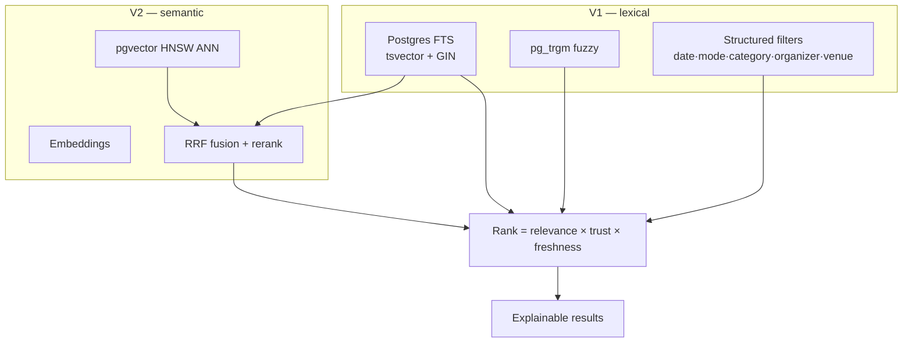

**Why this progression:** V1 lexical+filter search on Postgres meets the immediate need with zero new infrastructure (§7.1). V2 adds semantic understanding via pgvector, **fused** with lexical (§4.3) so we keep exact-match precision. **Why trust is a ranking input, not just a badge:** ADR-009 — a canonical platform ranks *reliable* results up. **Why explainable ranking:** users (and stewards) can ask "why this order?" — a trust differentiator, and a debugging tool.

---

## 13. AI Pipeline

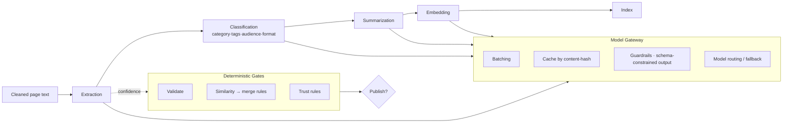

**Why a Model Gateway abstraction:** the audit found **four different model strings** and a hardcoded model ignoring config. The gateway makes model choice **one configurable decision**, enables **batching** (huge cost lever the audit flagged as missing), **content-hash caching** (never re-extract unchanged pages — fixes the quota-burn risk), **schema-constrained outputs**, and **provider fallback**. Models change monthly; the gateway contains that volatility.

**Why AI outputs feed deterministic gates (ADR-005):** AI produces fields + confidence; **rules decide** publish/merge/trust. This keeps the consequential decisions **explainable and safe** — the city never sees a black-box verdict.

---

## 14. Event Processing Engine

The orchestrator implementing the `05` lifecycle state machine as an **idempotent, resumable** workflow.

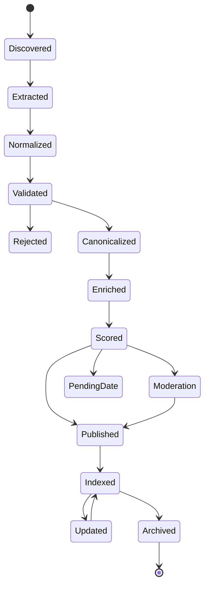

**Why an explicit state machine:** each event's `pipeline_state` is persisted, so a crashed/retried worker **resumes** rather than restarts, and every stage is **independently retryable and idempotent**. This turns a fragile linear script (the V0 pipeline) into a resilient, observable workflow where you can query "how many events are stuck in `Enriched`?" — an operational superpower.

---

## 15. Trust Score Engine

**Decision: deterministic, versioned, explainable scoring — config-driven weights.**

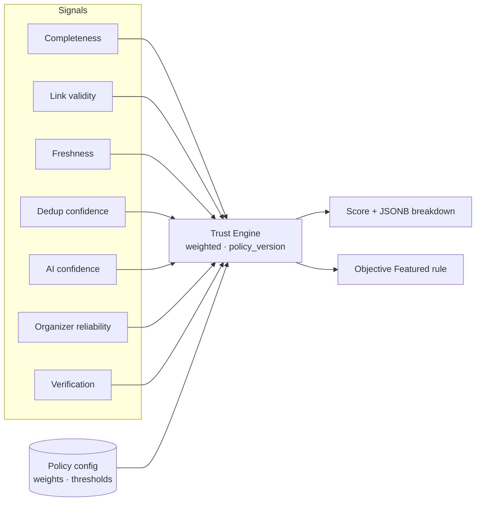

**Why deterministic (not ML) for trust:** trust must be **explainable and auditable** (ADR-006). A weighted rule engine can always answer "why 0.72?" with a signal breakdown. **Why versioned (`policy_version`):** when weights change, we know which policy produced a score and can recompute deterministically. **Why weights live in config, not code:** stewards tune policy transparently without a deploy — trust methodology is a product artifact, not a buried constant.

---

## 16. Analytics Engine

**Decision: capture interactions as an append-only event stream; separate analytical reads from OLTP.**

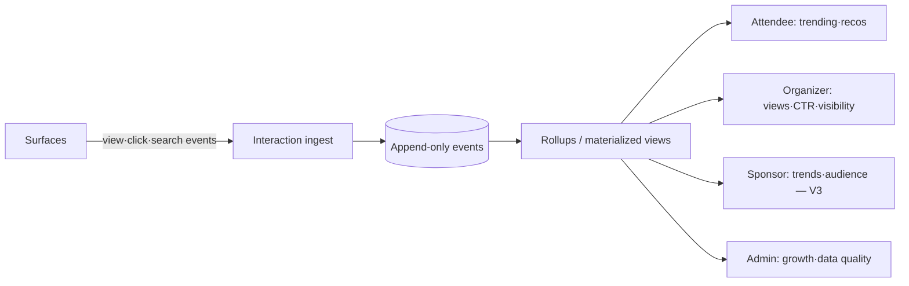

**Why separate analytics from the serving DB:** analytical scans (trends, aggregations) and OLTP serving have opposite access patterns; mixing them lets a heavy dashboard query degrade the public site. **Why start simple:** V2 can run rollups as Postgres materialized views on an append-only table; **trigger to adopt a warehouse** (BigQuery/ClickHouse) is when analytical volume or query complexity threatens OLTP — not before. **Why append-only:** interaction data is immutable facts; append-only is cheap, auditable, and reprocessable.

---

## 17. Monitoring

**RED for services, USE for resources, and — most importantly — pipeline-health SLOs.**

| Layer | Signals |
|---|---|
| Services (RED) | Rate, Errors, Duration per endpoint & worker. |
| Resources (USE) | Utilization, Saturation, Errors (CPU/RAM/queue depth/DB connections). |
| **Pipeline health** | **events published / hour, discovery success rate, queue depth, DLQ size, AI quota consumed, dead-link rate.** |
| Data quality | dedup review rate, moderation backlog, staleness. |

**Critical alert (the audit's #1 risk):** **"no events published in N hours"** and **"discovery success rate = 0"** page immediately. The dangerous failure here is *silent* — the site keeps serving cached data while ingestion has quietly died. **Why SLOs:** they turn "is it working?" into a measured, alertable contract (e.g., "95% of announced events published within 24h").

---

## 18. Logging & Tracing

- **Structured JSON logs** (already in V0 via structlog) with a **correlation/trace id** threaded from API → queue → worker → model gateway.
- **Distributed tracing (OpenTelemetry)** across the async boundary.
- Central aggregation; PII-aware (submitter emails redacted/hashed).

**Why tracing given async:** an event's journey spans API, queue, renderer, pipeline, and AI over minutes. Without a trace id following it, debugging "why did this event get rejected?" is archaeology. With it, you replay the whole lifecycle for one event.

---

## 19. Security

| Concern | Control | Why |
|---|---|---|
| **SSRF (critical for a URL-ingesting system)** | Renderers run in an **isolated, egress-restricted** sandbox; URL allow/deny lists; block internal IP ranges & metadata endpoints. | We fetch arbitrary user/AI-supplied URLs — a classic SSRF vector. This is the top security risk and was not addressed in V0. |
| AuthN/Z | Steward RBAC (roles: steward, admin, super-admin); short-lived JWT + refresh; managed identity for service-to-service. | V0 had a single admin + default `JWT_SECRET=change_me`. Real RBAC + secret hygiene required. |
| Secrets | Secrets Manager; no secrets in env files committed; rotation. | Audit found default secrets & hand-pasted hashes. |
| Input validation | Schema validation on all inputs; scraped content treated as untrusted. | Injection & prompt-injection surface. |
| Prompt-injection | Gateway guardrails; scraped text is data, never instructions; schema-constrained outputs. | Scraped pages can contain adversarial content aimed at the LLM. |
| Network | Private data plane; only edge/API public; WAF/bot rules. | Minimize attack surface. |
| Supply chain | Dependency & image scanning in CI. | Known-CVE prevention. |
| Data protection | Encrypt at rest & in transit; minimal PII (submitter emails). | Baseline. |

---

## 20. CI/CD

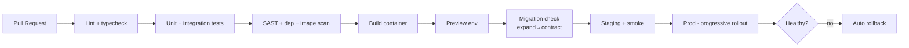

**Why this shape:** the audit found **zero tests** despite a configured test target — CI **gates merges on tests** for the pure decision functions (dedup, trust, publish) that decide what the city sees; those are the highest-ROI tests. **Why expand→contract migrations:** schema changes deploy without downtime (add-then-migrate-then-remove) — essential when the DB holds the durable asset. **Why progressive rollout + auto-rollback:** contain blast radius; a bad deploy self-heals.

---

## 21. Disaster Recovery

| Element | Strategy | Target |
|---|---|---|
| **Canonical graph (the asset)** | Postgres **PITR** + daily snapshots, cross-region copy. | **RPO ≤ 5 min, RTO ≤ 1 hr.** |
| Read availability | Replicas + CDN can serve stale-but-safe during primary loss. | Reads survive a primary outage. |
| Object storage | Versioned, durable, replicated. | 11-nines durability class. |
| Queue | Managed durable queue; jobs survive worker loss; idempotent replay. | No lost/duplicated side effects. |
| Config & secrets | Versioned, restorable. | Recreate env from code. |
| **Runbooks** | Documented recovery for: primary failover, quota exhaustion, pipeline stall, bad-merge mass-rollback. | Human-executable under stress. |

**Why RPO/RTO explicit and asset-weighted:** everything else is reconstructible from sources; the **cleaned, deduplicated, trust-scored history is not** (re-scraping can't recover deleted merges/provenance). DR spends its strictest budget on the graph (ADR-010).

---

## 22. Rate Limiting

**Decision: distributed token-bucket in Redis, tiered by surface.**

| Tier | Limit intent | Why |
|---|---|---|
| Public reads | generous; CDN absorbs most | protect origin from scraper abuse |
| Submissions | strict (e.g., few/hour/IP) | spam prevention |
| Auth/admin | strict + lockout | brute-force protection |
| Public API (V3) | per-key quotas | fair use & monetization |

**Why distributed (not in-memory):** the audit found **in-memory rate limiting**, which is per-instance and useless behind an autoscaled fleet (each instance counts separately). A Redis-backed limiter enforces limits **globally** across all instances.

---

## 23. Configuration Strategy

- **12-factor**, typed settings, environment-injected; **secrets in a manager**, not files.
- **Single source of truth per setting** — one model string, resolved everywhere (fixes the four-strings finding).
- **Policy-as-data:** trust weights/thresholds and source trust live in config/DB, tunable by stewards without deploy.
- **Per-city config:** city is a first-class dimension (ADR-011) — branding, timezone, sources scoped per city.
- **Feature flags:** gate V2/V3 capabilities and risky changes.

**Why:** the audit's config chaos (four model strings, R2 settings that crash, dead Meetup vars) came from configuration sprawl. Centralized, typed, single-source config makes the system's behavior **predictable and one-knob-tunable.**

---

## 24. Scalability Strategy

Driven entirely by the **read-heavy / write-light / reads-spike-only** asymmetry (§0.1).

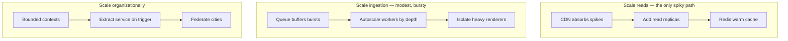

| Axis | Mechanism | Why |
|---|---|---|
| Read spikes | CDN → replicas → cache | reads are the only thing that spikes; edge handles 90%+. |
| Ingestion bursts | queue + autoscale-by-depth | decouple bursty discovery from rate-limited AI. |
| Heavy work | isolated renderer pool | protect the hot path. |
| Stateless services | horizontal autoscale | no per-instance state to shard. |
| Data growth | partition + archive; replicas | keep hot set small. |
| Org growth | extract-on-trigger; per-city scoping | evolve without rewrite. |

**Why not shard the DB now:** at our data sizes, a single primary + replicas is *decades* from a sharding need. Sharding is complexity we explicitly refuse until measured.

---

## 25. Performance Optimization

| Technique | Applied to | Why |
|---|---|---|
| **Materialized read models** (`search_document`, feeds) | search & lists | eliminate runtime joins on the hot path. |
| **Connection pooling (PgBouncer)** | all DB access | fixes V0 `NullPool` (new connection/request) — a real ceiling. |
| **Content-hash AI cache** | extraction/embedding | never pay to re-process unchanged pages. |
| **Embedding cache** | semantic search | reuse query/document vectors. |
| **ISR / edge rendering** | event pages | SEO + speed without hitting origin. |
| **Index discipline** | FTS (GIN), vector (HNSW), filter columns | avoid seq scans; the audit found an `ILIKE` OR-branch defeating the FTS index — corrected. |
| **Batching** | AI calls | fewer round-trips, lower cost/latency. |
| **N+1 avoidance** | list endpoints | projections carry everything in one row. |
| **Image optimization + CDN** | posters | offload bandwidth. |

---

## 26. Bottleneck analysis (interviewer's closing)

| Potential bottleneck | Reality at our scale | Mitigation / trigger |
|---|---|---|
| DB write throughput | non-issue (tiny writes) | — |
| DB read under spike | mitigated by CDN + replicas | add replicas if replica CPU climbs |
| AI cost/quota | **real** (biggest operational risk) | gateway caching + batching + confidence-gated calls |
| Playwright rendering | **real** (slow, heavy) | isolated pool, warm floor, timeouts, DLQ |
| Silent pipeline failure | **real** (top risk) | health SLOs + paging alerts |
| Dedup correctness | **real** (trust risk) | precision-first rules + steward review + reversible merges |
| Search relevance at scale | future | trigger to adopt dedicated engine |

**The honest summary:** our bottlenecks are **cost, correctness, and operational visibility** — not throughput. The architecture spends its complexity budget precisely there, and stays deliberately boring everywhere else.

---

## Panel closing note

The **Google Staff Engineer** and **Uber Infra Engineer** insisted we architect for the *actual* failure modes (silent decay, cost, correctness) and refuse throughput theater. The **Cloud Solution Architect** kept it managed, portable, and budget-sane for a nonprofit. The **AI Platform Architect** contained model volatility behind a gateway and held the enrich-vs-decide line. The **System Design Interviewer** enforced the through-line: *clarify scale → justify from load → name the bottleneck → design for evolution.* The result is a system that is **simple where it can be, isolated where it must be, and evolvable where it will need to be** — production-ready for V1, and pre-seamed for the V3 knowledge-graph platform.
