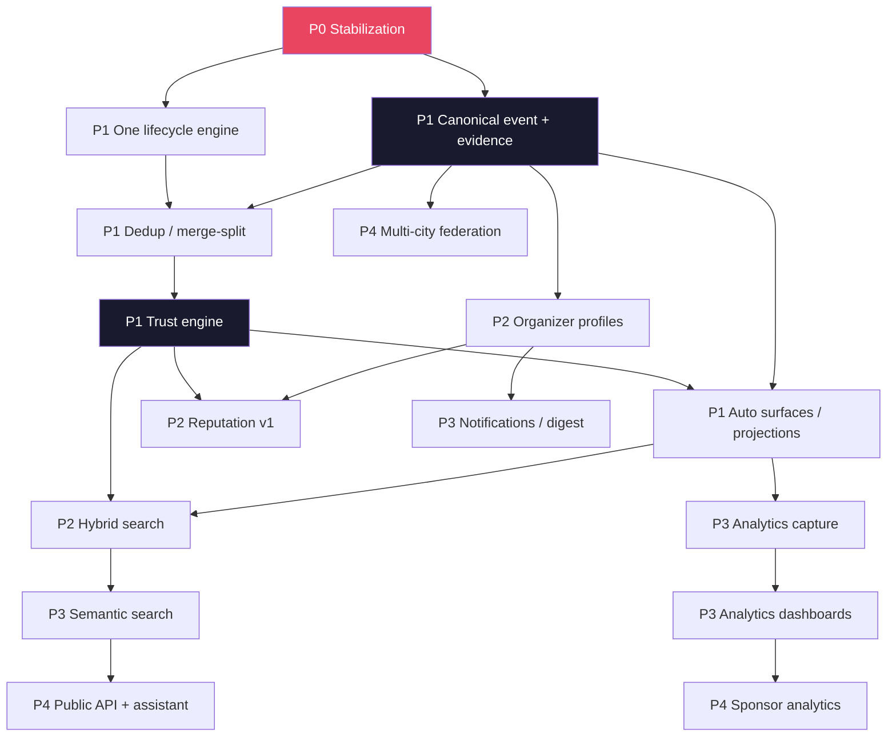
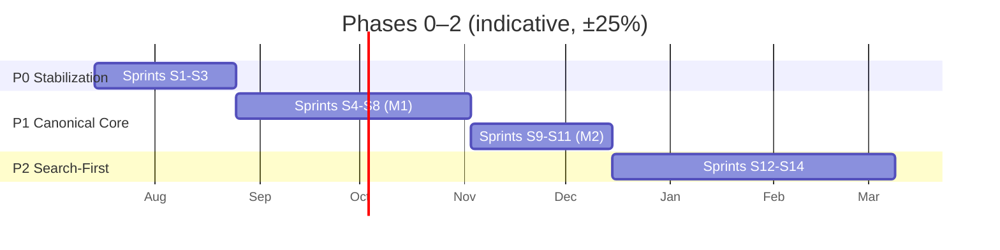
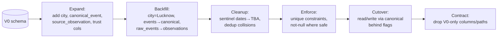

# 07 — Implementation Roadmap: City Event Hub Platform

> **Author role:** Engineering Director
> **Status:** Architecture approved (`06_System_Architecture.md`). This is the execution plan.
> **Inputs:** `01`–`06`. **Output goal:** copy-paste-ready GitHub Milestones, Epics, and Issues.
> **⟳ Evolved (Platform Evolution) — amendments:** The existing epic **DM (Domain Model Migration)** generalizes **City → Tenant** (add `tenant_id` + RLS everywhere, not just a city column). Three **new epic families** are inserted into the plan and detailed in the `09` backlog addendum: **PLT-Tenancy** (tenant entity, resolution, RLS, isolation tests), **PLT-Config** (instance-config schema, loader, validation, remove hard-coded Lucknow assumptions), **PLT-Plugins** (ports, registry, conformance suites, SDK) and **PLT-OSS** (one-command deploy, docs, contribution workflow, versioning). Sequencing guidance: **do Tenancy + Config alongside/just after P1 (Canonical Core)** — they are cheap if done early and expensive to retrofit; defer full plugin-ification of a port until a second implementation exists (ADR-014). Milestone map and effort in `10_Architecture_Evolution.md §4` and the `09` addendum.

---

## 0. Director's framing

### 0.1 Strategy: strangler-fig, not rewrite

V0 works and serves traffic. We **do not** stop the world. We introduce the target domain model *alongside* the existing one, migrate data with expand→contract, cut over behind feature flags, and delete V0 paths only after parity. Every phase ships something live.

### 0.2 Team assumptions (drives every estimate)

> **Assumed capacity:** ~2 core engineers (one backend/pipeline-heavy, one full-stack), plus intermittent community/intern contributors, ~2-week sprints, ~part-time-to-full-time. **All calendar estimates below assume this and carry a 25% buffer.** With more hands, compress; with fewer, extend. Estimates are *complexity-first, calendar-second.*

### 0.3 Estimation legend

| Size | Points | Rough effort (1 eng) |
|---|---|---|
| S | 1–2 | ≤ half day |
| M | 3 | 1–2 days |
| L | 5 | 3–4 days |
| XL | 8 | ~1 sprint |
| XXL | 13 | split it — too big |

### 0.4 Label taxonomy (create these in GitHub first)

`type:feature` · `type:bug` · `type:refactor` · `type:chore` · `type:infra` · `type:test` · `type:docs` · `type:spike`
`area:ingestion` · `area:api` · `area:search` · `area:ai` · `area:trust` · `area:frontend` · `area:data` · `area:infra` · `area:security` · `area:observability`
`priority:P0` · `priority:P1` · `priority:P2`
`phase:0` · `phase:1` · `phase:2` · `phase:3`
`size:S` · `size:M` · `size:L` · `size:XL`
`good-first-issue` (for community contributors)

---

## 1. Project Phases

| Phase | Name | Goal | Ships | Maps to |
|---|---|---|---|---|
| **P0** | **Stabilization & Foundations** | Kill the audit landmines; make prod trustworthy & observable. | A pipeline that reliably runs, is tested, and won't silently die. | Audit fixes |
| **P1** | **Canonical Core** | Re-platform the domain: canonical event + evidence + one lifecycle + transparent trust + auto surfaces. | The single-source-of-truth model, live. | Vision V1, ADR-001/002/003/005/006/007 |
| **P2** | **Search-First Discovery** | Make discovery excellent: hybrid search, ranking by trust×freshness, organizer profiles. | Search-first UX + organizer identity. | Vision V1→V2, ADR-009, Epic F/H |
| **P3** | **Intelligence Layer** | Semantic search, reputation, notifications, analytics. | Proactive discovery + data-driven reputation. | Vision V2, Epic I/J |
| **P4** | **Ecosystem Platform** | Public API, sponsor analytics, assistant, federation. | The knowledge-graph platform. | Vision V3, Epic K, ADR-010/011 |

> **Director's note:** P0 and P1 are the plan. P2 is scoped. P3–P4 are *directional* — we write detailed issues only 1 phase ahead. Over-planning V3 today is waste.

---

## 2. Milestones (exit criteria)

| Milestone | Exit criteria (Definition of Done for the milestone) |
|---|---|
| **M0 — Stable Prod** | Pipeline runs on a durable scheduler; distributed rate limiting; single model config; DB pooling; content-hash change detection working; CI runs tests on every PR; pipeline-health alert paging. |
| **M1 — Canonical Model** | `canonical_event` + `source_observation` live; V0 data migrated; unique constraints enforced; nullable dates + `date_status`; reversible merge/split; provenance retained. |
| **M2 — Trust & Surfaces** | Deterministic, versioned, explainable Trust Score; publish gated by threshold; objective Featured; all surfaces generated from canonical (pages/cards/calendar/feeds). |
| **M3 — Search-First** | Hybrid lexical+filter search ranked by relevance×trust×freshness; index as read model; search health monitored. |
| **M4 — Organizer Identity** | Auto organizer profiles; claim/verify flow; data-driven reputation (V1 signals). |
| **M5 — Intelligence** | Semantic/NL search; notifications & digest; organizer/attendee analytics. |
| **M6 — Platform** | Public API; sponsor analytics; assistant; second-city federation proof. |

---

## 3. GitHub Milestones (create verbatim)

```
M0  Stable Prod              — Phase 0  — target: Sprints 1–3
M1  Canonical Model          — Phase 1  — target: Sprints 4–7
M2  Trust & Surfaces         — Phase 1  — target: Sprints 7–9
M3  Search-First             — Phase 2  — target: Sprints 10–12
M4  Organizer Identity       — Phase 2  — target: Sprints 12–14
M5  Intelligence Layer       — Phase 3  — target: Sprints 15–20
M6  Ecosystem Platform       — Phase 4  — target: Sprints 21+
```

---

## 4. Dependency Graph



**Critical path:** P0 → Canonical event+evidence → Lifecycle → Dedup → Trust → Surfaces → Search. Everything downstream hangs off a correct canonical model + trust.

---

## 5. Epic Breakdown

Epics reuse PRD letters where applicable; infra epics are numbered.

| Epic | Title | Phase | Milestone | Complexity | Depends on |
|---|---|---|---|---|---|
| **INF-0** | Stabilization & prod hardening | P0 | M0 | XL | — |
| **INF-1** | Bounded-context refactor & seams | P0/P1 | M0/M1 | L | INF-0 |
| **B** | Unified ingestion & structuring | P1 | M1 | XL | INF-0 |
| **C** | Canonicalization: dedup / merge / split | P1 | M1 | XL | B |
| **DM** | Domain model migration (V0→canonical) | P1 | M1 | XL | INF-1 |
| **LC** | Lifecycle state-machine engine | P1 | M1 | L | DM |
| **D** | AI enrichment via Model Gateway | P1 | M2 | L | LC |
| **E** | Trust Score engine (transparent) | P1 | M2 | L | C, D |
| **G** | Auto-generated surfaces / projections | P1 | M2 | L | E |
| **F** | Search-first (lexical + filter + rank) | P2 | M3 | L | G, E |
| **H** | Organizer identity & reputation | P2 | M4 | L | DM, E |
| **SEC** | Security hardening (SSRF, RBAC, secrets) | P0/P2 | M0/M4 | L | INF-0 |
| **OBS** | Observability & SLOs | P0 | M0 | M | INF-0 |
| **I** | Proactive discovery (notifications/digest) | P3 | M5 | L | H |
| **J** | Analytics engine | P3 | M5 | XL | G |
| **F2** | Semantic / NL search | P3 | M5 | L | F |
| **K** | Ecosystem platform (API/assistant/reports) | P4 | M6 | XL | F2, J |
| **FED** | Multi-city federation | P4 | M6 | L | DM |

---

## 6. Feature Breakdown (per epic, summary)

- **INF-0:** durable scheduler · distributed rate limiting · single model config · PgBouncer pooling · content-hash change detection · CI test gate · pipeline-health alert · fix async event-loop.
- **DM:** city dimension · `canonical_event` (nullable dates + `date_status`) · `source_observation` evidence table · unique constraints · backfill migrations · sentinel-date cleanup.
- **B:** source adapter framework (pluggable) · extraction via gateway · normalization · validation (real/upcoming/link-valid).
- **C:** similarity scoring · match rules (precision-first) · merge with provenance · reversible split · steward review surface.
- **LC:** persisted `pipeline_state` · idempotent stages · resumable workers · state observability.
- **D:** Model Gateway (batching/cache/guardrails/routing) · category/tags/audience/format · summary · embeddings.
- **E:** signal computation · versioned weighted score · JSONB breakdown · policy-as-config · objective Featured rule.
- **G:** `search_document` projection · feeds (JSON/ICS) as CDN objects · event pages/cards/calendar from canonical · cache purge on publish.
- **F:** FTS+filters · ranking relevance×trust×freshness · explainable results · search health metrics.
- **H:** organizer/venue entities · profiles · claim/verify · reputation v1 signals.
- **SEC:** SSRF sandbox + egress controls · RBAC roles · secrets manager · dependency/image scanning · prompt-injection guardrails.
- **OBS:** RED/USE metrics · SLOs · dashboards · tracing (correlation ids) · alerting.

---

## 7. Issue Breakdown (GitHub-ready)

Format per issue: **`[ID] Title`** · labels · size · depends-on · description · acceptance criteria. IDs are references; GitHub will assign numbers.

### PHASE 0 — Stabilization (Milestone M0)

---

**`[P0-01] Route all Gemini calls through a single configurable model string`**
`type:refactor` `area:ai` `priority:P0` `phase:0` `size:M`
**Depends on:** —
**Description:** Audit found 4 model strings; discovery hardcodes `gemini-2.0-flash`. Introduce one setting resolved everywhere; remove hardcodes; validate the value at startup.
**Acceptance:**
- All AI callers read the model from one config source.
- Startup fails fast on an invalid/empty model.
- No hardcoded model strings remain (grep-clean).

**`[P0-02] Replace in-memory rate limiting with distributed Redis limiter`**
`type:refactor` `area:api` `area:security` `priority:P0` `phase:0` `size:M`
**Depends on:** —
**Acceptance:**
- Limits enforced globally across instances (verified with 2+ instances).
- Tiers: public read (generous), submission (strict), auth (strict + lockout).

**`[P0-03] Introduce PgBouncer (transaction pooling); remove NullPool-per-request`**
`type:infra` `area:infra` `area:data` `priority:P0` `phase:0` `size:M`
**Acceptance:**
- App connects via pooler; no new physical connection per request.
- Load test shows stable connection count under concurrent reads.

**`[P0-04] Move snapshot change-detection from ephemeral FS to DB content-hash`**
`type:refactor` `area:ingestion` `priority:P0` `phase:0` `size:M`
**Depends on:** —
**Acceptance:**
- `raw_capture.content_hash` persisted; unchanged pages skip AI extraction.
- Verified: redeploy/restart does not re-process unchanged pages.

**`[P0-05] Deploy a durable scheduler + always-on worker plane`**
`type:infra` `area:infra` `area:ingestion` `priority:P0` `phase:0` `size:L`
**Depends on:** —
**Description:** Audit found no worker/beat in committed prod config. Stand up managed scheduler → queue → worker; ensure single-fire (no duplicate beats).
**Acceptance:**
- Discovery/crawl/expiry run on schedule in prod, verifiable in logs/metrics.
- No duplicate scheduled executions.

**`[P0-06] Pipeline-health alerting: "no events published in N hours"`**
`type:infra` `area:observability` `priority:P0` `phase:0` `size:M`
**Depends on:** P0-05
**Acceptance:**
- Alert pages when published/hour = 0 for N hours or discovery success = 0.
- Runbook link attached to the alert.

**`[P0-07] Fix async execution: replace deprecated get_event_loop usage`**
`type:bug` `area:ingestion` `priority:P1` `phase:0` `size:S`
**Acceptance:** All Celery tasks use a safe async runner; no `get_event_loop` deprecation warnings on 3.12.

**`[P0-08] Add DB unique constraints + escape LIKE in dedup`**
`type:bug` `area:data` `priority:P0` `phase:0` `size:M`
**Description:** Add `UNIQUE(canonical_url)` (pre-city); drop substring ILIKE title match; escape LIKE metacharacters.
**Acceptance:** Concurrent crawls cannot double-insert; over-merge on substring titles eliminated; unit tests cover both.

**`[P0-09] CI pipeline with test gate + lint + scan`**
`type:infra` `area:infra` `area:test` `priority:P0` `phase:0` `size:L`
**Acceptance:** PRs blocked on failing lint/tests; dependency + image scan run; a `tests/` dir exists and runs.

**`[P0-10] Unit tests for pure decision functions (dedup, relevance, publish score)`**
`type:test` `area:trust` `area:ingestion` `priority:P0` `phase:0` `size:M`
**Depends on:** P0-09
**Acceptance:** Branch coverage on the functions that decide what publishes; edge cases (missing date, junk title, boundary scores) tested.

**`[P0-11] SSRF sandbox for renderer workers (egress controls, IP allow/deny)`**
`type:feature` `area:security` `priority:P0` `phase:0` `size:L`
**Description:** We fetch arbitrary URLs. Isolate renderers; block internal IP ranges/metadata endpoints; timeout & size caps.
**Acceptance:** Attempts to fetch internal/metadata addresses are blocked; renderers cannot reach the private network.

**`[P0-12] Isolate Playwright into a dedicated worker image/pool`**
`type:refactor` `area:infra` `area:ingestion` `priority:P1` `phase:0` `size:M`
**Acceptance:** API image no longer bundles Chromium; renderers run in their own pool with a warm floor.

**`[P0-13] Config & secrets hygiene`**
`type:chore` `area:security` `priority:P1` `phase:0` `size:S`
**Acceptance:** No default `JWT_SECRET` in prod; secrets in a manager; dead vars (Meetup) removed; R2 settings declared so `STORAGE_TYPE=r2` doesn't crash; README/clone URL corrected.

---

### PHASE 1 — Canonical Core (Milestones M1, M2)

---

**`[DM-01] Add City dimension; backfill Lucknow`**
`type:feature` `area:data` `priority:P0` `phase:1` `size:M`
**Depends on:** P0-08
**Acceptance:** `city` entity exists; all existing rows backfilled to Lucknow; city is first-class on canonical identity (ADR-011).

**`[DM-02] Introduce canonical_event with nullable start_at + date_status`**
`type:feature` `area:data` `priority:P0` `phase:1` `size:L`
**Depends on:** DM-01
**Description:** Replace sentinel-date hack. Migrate 2027/2050/2090 sentinels → `date_status='tba'`, `start_at=NULL`.
**Acceptance:** No sentinel dates remain; TBA is a real state; calendar excludes TBA correctly; ordering `NULLS LAST`.

**`[DM-03] Introduce source_observation (evidence) table + backfill from raw_events`**
`type:feature` `area:data` `priority:P0` `phase:1` `size:L`
**Depends on:** DM-02
**Acceptance:** Each canonical event links to ≥1 observation; existing `raw_events` mapped to observations preserving provenance.

**`[DM-04] Composite unique constraints (city_id, canonical_url) & (city_id, slug)`**
`type:feature` `area:data` `priority:P0` `phase:1` `size:M`
**Depends on:** DM-01, P0-08
**Acceptance:** Idempotency enforced per city at the DB level.

**`[LC-01] Persisted lifecycle state machine + resumable, idempotent stages`**
`type:feature` `area:ingestion` `priority:P0` `phase:1` `size:XL`
**Depends on:** DM-03
**Acceptance:** Each event has a persisted `pipeline_state`; a crashed worker resumes; each stage safely re-runnable; "events stuck in state X" is queryable.

**`[B-01] Pluggable source adapter contract`**
`type:refactor` `area:ingestion` `priority:P1` `phase:1` `size:M`
**Acceptance:** Adding a source is config + adapter with no lifecycle change (ADR-003); generic + static adapters conform.

**`[B-02] Validation stage: real / upcoming / tech-relevant / link-valid`**
`type:feature` `area:ingestion` `priority:P0` `phase:1` `size:M`
**Acceptance:** Non-events rejected; unreachable registration link blocks publish (→ moderation).

**`[C-01] Similarity scoring across title/date/venue/organizer/URL + AI score`**
`type:feature` `area:ingestion` `area:ai` `priority:P0` `phase:1` `size:L`
**Depends on:** DM-03
**Acceptance:** Combined similarity produces a score; precision-first thresholds; unit-tested against a labeled fixture set.

**`[C-02] Merge into canonical with provenance; reversible split`**
`type:feature` `area:data` `priority:P0` `phase:1` `size:L`
**Depends on:** C-01
**Acceptance:** Merge preserves all evidence + records reason; a steward can split a wrong merge back to distinct events.

**`[C-03] Steward review surface for uncertain matches`**
`type:feature` `area:frontend` `area:api` `priority:P1` `phase:1` `size:M`
**Depends on:** C-01
**Acceptance:** Uncertain merges queue with AI reasoning + evidence shown; approve/correct/reject updates canonical.

**`[D-01] Model Gateway: batching, content-hash cache, guardrails, routing`**
`type:feature` `area:ai` `priority:P0` `phase:1` `size:L`
**Depends on:** P0-01
**Acceptance:** One provider-agnostic entry point; unchanged inputs served from cache; schema-constrained outputs; provider fallback; batch path exists.

**`[D-02] Enrichment: category / tags / audience / format / summary`**
`type:feature` `area:ai` `priority:P1` `phase:1` `size:M`
**Depends on:** D-01
**Acceptance:** Published events auto-classified; each enrichment attributable/explainable.

**`[E-01] Trust Score engine: signals → versioned weighted score + JSONB breakdown`**
`type:feature` `area:trust` `priority:P0` `phase:1` `size:L`
**Depends on:** C-02, D-02
**Acceptance:** Deterministic; `policy_version` stored; breakdown persisted; "why 0.72?" answerable.

**`[E-02] Publish gate by trust threshold + objective Featured rule`**
`type:feature` `area:trust` `priority:P0` `phase:1` `size:M`
**Depends on:** E-01
**Acceptance:** Below threshold → moderation; Featured is a pure function of trust+freshness+completeness (no manual entries).

**`[E-03] Policy-as-config: trust weights & thresholds tunable without deploy`**
`type:feature` `area:trust` `priority:P2` `phase:1` `size:M`
**Depends on:** E-01
**Acceptance:** Steward can adjust weights via config/DB; changes versioned.

**`[G-01] search_document projection materialized from canonical`**
`type:feature` `area:api` `area:search` `priority:P0` `phase:1` `size:M`
**Depends on:** E-02
**Acceptance:** One denormalized read row per published event; no runtime joins on list/search.

**`[G-02] Feeds (JSON/ICS) as CDN objects, rebuilt on publish`**
`type:refactor` `area:api` `priority:P1` `phase:1` `size:M`
**Description:** V0's `rebuild_all_feeds` is a stub. Materialize feeds; purge on publish.
**Acceptance:** Feeds served as static objects; update within one TTL of a publish.

**`[G-03] All surfaces (pages/cards/calendar) generated from canonical + cache purge`**
`type:feature` `area:frontend` `area:api` `priority:P1` `phase:1` `size:M`
**Depends on:** G-01
**Acceptance:** No hand-authored surfaces; publish/update purges affected cache keys.

---

### PHASE 2 — Search-First & Organizer Identity (Milestones M3, M4)

Issues summarized (write full issues at start of Phase 2):

- **`[F-01]` FTS + filters read path on `search_document`** — L
- **`[F-02]` Ranking = relevance × trust × freshness (explainable)** — M
- **`[F-03]` Fix indexed search (remove ILIKE OR-branch defeating GIN)** — S
- **`[F-04]` Search health metrics (success rate, latency)** — S
- **`[H-01]` Organizer & Venue entities + backfill** — M
- **`[H-02]` Auto organizer profiles (upcoming/past/categories/links)** — M
- **`[H-03]` Organizer claim & verify flow** — M
- **`[H-04]` Reputation v1 (history-derived signals)** — L
- **`[SEC-01]` RBAC roles (steward/admin/super-admin) + refresh tokens** — M

---

### PHASE 3 — Intelligence (Milestone M5) — directional

- **`[F2-01]` Embeddings + pgvector HNSW index** — M
- **`[F2-02]` Hybrid search (RRF fusion) + rerank** — L
- **`[F2-03]` Natural-language query understanding** — L
- **`[I-01]` Subscriptions (category/organizer/venue)** — M
- **`[I-02]` Weekly digest generation + delivery** — L
- **`[I-03]` Notifications** — M
- **`[J-01]` Interaction capture (append-only)** — M
- **`[J-02]` Organizer analytics (views/CTR/visibility)** — L
- **`[J-03]` Attendee analytics (trending/recommendations)** — L

### PHASE 4 — Ecosystem Platform (Milestone M6) — directional

- **`[K-01]` Public API + API keys/quotas** — L
- **`[K-02]` Conversational assistant over the graph** — XL
- **`[J-04]` Sponsor analytics dashboards** — L
- **`[K-03]` City ecosystem reports** — M
- **`[FED-01]` Multi-city federation (2nd city proof)** — L

---

## 8. Sprint Planning (Phases 0–1 detailed)

2-week sprints. Assumes ~2 engineers. Reprioritize at each sprint review.

| Sprint | Focus | Issues | Milestone |
|---|---|---|---|
| **S1** | Stop the bleeding | P0-01, P0-02, P0-03, P0-07 | M0 |
| **S2** | Pipeline reliability | P0-04, P0-05, P0-06, P0-08 | M0 |
| **S3** | Quality & safety gates | P0-09, P0-10, P0-11, P0-12, P0-13 | M0 |
| **S4** | Domain foundation | DM-01, DM-02, DM-04 | M1 |
| **S5** | Evidence + lifecycle | DM-03, LC-01 (start) | M1 |
| **S6** | Lifecycle + adapters | LC-01 (finish), B-01, B-02 | M1 |
| **S7** | Canonicalization | C-01, C-02 | M1 |
| **S8** | Review + gateway | C-03, D-01 | M1→M2 |
| **S9** | Enrichment + trust | D-02, E-01 | M2 |
| **S10** | Trust + surfaces | E-02, G-01, G-02 | M2 |
| **S11** | Surfaces + policy | G-03, E-03; P1 hardening/QA | M2 |

*(Phase 2+ sprints planned at the Phase 1 close review.)*



---

## 9. Folder Refactoring Plan

Move from V0's layered layout toward bounded-context modules (seams from `06 §3`), incrementally — not in one big-bang PR.

```
backend/
├── contexts/
│   ├── ingestion/        # sources, adapters, capture      (from ingestion/adapters, workers/tasks/crawl,discovery)
│   ├── event/            # canonical event, dedup, merge/split, provenance   (from ingestion/pipeline, dedup)
│   ├── lifecycle/        # state machine engine            (new; extracts orchestration from pipeline.py)
│   ├── enrichment/       # AI orchestration                (from ai/*, wrapped by gateway)
│   ├── trust/            # scoring, policy                 (from ingestion/publish_score, relevance)
│   ├── search/           # query + rank + projections
│   ├── organizer/        # profiles, reputation            (new, P2)
│   ├── analytics/        # capture + rollups               (new, P3)
│   └── admin/            # moderation, steward tools       (from api/routers/admin)
├── platform/
│   ├── gateway/          # Model Gateway                   (new; wraps ai/gemini_client)
│   ├── db/               # engine, pooling, migrations
│   ├── cache/            # redis cache-aside, locks
│   ├── queue/            # producers/consumers
│   ├── config/           # typed settings (single source)  (from api/core/config)
│   └── observability/    # logging, metrics, tracing
└── api/                  # thin HTTP layer over contexts   (routers → context interfaces)
```

**Refactor rules:**
- One context per PR; keep V0 paths working until the context reaches parity.
- Each context exposes an explicit interface; cross-context calls go through the in-process event bus.
- `pipeline.py` (755 LoC) is decomposed into `lifecycle/` stages — highest-value refactor, do it in LC-01.

---

## 10. Migration Strategy (data)

**Principle:** expand → migrate → contract. Zero downtime. Every step reversible.



| Step | Action | Safety |
|---|---|---|
| Expand | Add new tables/columns nullable; dual-write where needed. | Additive; no reads change. |
| Backfill | Batch jobs; idempotent; resumable; log progress. | Runs online; re-runnable. |
| Cleanup | Sentinel dates → `date_status='tba'`; resolve `canonical_url` collisions before adding unique index. | Verified counts before/after. |
| Enforce | Add unique/not-null after data is clean. | Fails loudly if data dirty. |
| Cutover | Feature-flag reads/writes to canonical model. | Instant rollback via flag. |
| Contract | Remove V0 columns/paths after a bake period. | Only after parity + monitoring. |

**Backfill embeddings (P3):** separate batch job through the Model Gateway, rate-limited, resumable by cursor.

---

## 11. Testing Strategy

| Layer | What | Priority |
|---|---|---|
| **Unit** | Pure decision fns: dedup similarity, publish gate, trust scoring, validation, normalization. | **P0 — highest ROI** (they decide what the city sees). |
| **Golden dataset** | Labeled fixture of real event pages → expected extraction/dedup/trust outcomes. | P0 — the pipeline's regression net. |
| **Integration** | Lifecycle end-to-end with a mocked Model Gateway + test DB. | P1 |
| **Contract** | API request/response schemas; adapter output contract. | P1 |
| **AI mocking** | Deterministic gateway mock; never call real LLM in CI. | P0 |
| **E2E** | Submit URL → published event visible via API/search. | P2 |
| **Load** | Read-path spike test (CDN/replica/cache) + queue-depth autoscale. | P2 |
| **Security** | SSRF test suite (internal-IP/metadata attempts blocked). | P0 |

**Coverage policy:** decision functions ≥ 90% branch; overall rising floor enforced in CI.

---

## 12. QA Plan

- **Environments:** local → preview (per-PR) → staging → prod.
- **Review gates:** every PR needs green CI + 1 review; migrations need a second reviewer.
- **Data-quality QA (the real QA here):** a weekly **golden-sample audit** — steward compares a random sample of published events against ground truth for correctness (date, link, dedup, category). Track: capture rate, dedup precision, dead-link rate, freshness. These are product-QA metrics, not just code QA.
- **Manual review checklist** for merges/moderation: evidence shown, AI reasoning visible, trust breakdown present.
- **Release smoke tests:** health, search returns, feeds valid, a known event renders, registration redirects out.

---

## 13. Release Plan

- **Cadence:** ship per sprint (or continuously once CI is trustworthy).
- **Migrations:** expand/contract only; never a destructive migration in the same deploy that stops using the column.
- **Feature flags:** every risky change (canonical cutover, new search, trust policy) is flag-gated for instant rollback.
- **Progressive rollout:** deploy → smoke → watch SLOs → promote; auto-rollback on health-check failure.
- **Comms:** changelog per release; steward notified of trust-policy or dedup-rule changes (they affect what publishes).

---

## 14. Definition of Done

**Issue DoD:** code + tests (incl. decision-fn tests where relevant) · passes CI (lint/test/scan) · docs/README updated if behavior changed · acceptance criteria met · no new P0 lint/security findings · reviewed & merged behind a flag if risky.

**Feature DoD:** all issues done · integration tests green · observability in place (metrics/logs for the feature) · runbook updated if operational.

**Epic DoD:** milestone exit criteria met · golden-dataset regression green · steward sign-off on any data-quality-affecting change.

**Release DoD:** smoke tests green in staging · migration verified reversible · SLOs healthy post-deploy · rollback tested/available.

---

## 15. Risk Register

| ID | Risk | Likelihood | Impact | Mitigation | Owner |
|---|---|---|---|---|---|
| R1 | **Silent pipeline decay** (stops publishing unnoticed) | Med | High | Health SLO + paging alert (P0-06); golden-sample audit. | Infra/Pipeline |
| R2 | **AI cost/quota blowout** | Med | High | Gateway caching + batching + confidence-gated calls (D-01). | AI |
| R3 | **Dedup over-merge** (two events collapse) | Med | High | Precision-first thresholds; steward review; reversible split; labeled tests (C-01/02). | Pipeline |
| R4 | **Data loss during migration** | Low | High | Expand/contract; backups + PITR; reversible steps; dry-run on staging clone. | Backend Lead |
| R5 | **SSRF via arbitrary URL fetch** | Med | High | Egress-restricted renderer sandbox (P0-11). | Security |
| R6 | **Small-team bandwidth / bus factor** | High | Med | Ruthless P0/P1 scoping; `good-first-issue` for contributors; docs-first. | Director |
| R7 | **Scope creep into management/ticketing** | Med | Med | Non-goals are policy; Director gate on any registration-capture idea. | Director/PM |
| R8 | **V0/target dual-running complexity** | Med | Med | Feature flags; one context per PR; short bake, then contract. | Backend Lead |
| R9 | **Trust score gamed or miscalibrated** | Low | Med | Transparent signals; versioned policy; steward tuning; audit against ground truth. | Trust |
| R10 | **Model provider change/deprecation** | Med | Med | Gateway routing + fallback; single config string. | AI |

---

## 16. Team Responsibilities (roles; a small team wears several)

| Role | Owns | Primary areas |
|---|---|---|
| **Eng Director / Tech Lead** | Roadmap, scope discipline, architecture integrity, risk. | INF, non-goals gate, reviews. |
| **Backend / Pipeline Engineer** | Domain model, lifecycle, dedup, trust, migrations. | DM, LC, B, C, E |
| **Full-stack Engineer** | API surfaces, frontend, search UX, admin/steward tools. | G, F, C-03, admin |
| **AI / Data (can be shared)** | Model Gateway, enrichment, embeddings, golden dataset. | D, F2, testing fixtures |
| **DevOps / Infra (can be shared)** | Scheduler, queue, CI/CD, observability, DR. | INF-0, OBS, releases |
| **Security (advisory/shared)** | SSRF, RBAC, secrets, scanning. | SEC |
| **Steward / QA (community + PM)** | Moderation, data-quality audit, policy tuning. | QA, trust policy, reputation review |

> **Reality check:** with ~2 engineers, one person is Tech Lead + Backend/Pipeline, the other is Full-stack + shares AI/Infra; Security and Steward are part-time hats. The plan is sequenced so the critical path needs only these two.

---

## 17. Estimated Complexity (rollup)

| Phase | Epics | Rough points | Confidence |
|---|---|---|---|
| P0 | INF-0, OBS, SEC(partial) | ~40 | High |
| P1 | DM, LC, B, C, D, E, G, INF-1 | ~95 | Med-High |
| P2 | F, H, SEC | ~50 | Med |
| P3 | F2, I, J | ~70 | Low-Med |
| P4 | K, FED, J(sponsor) | ~80 | Low (directional) |

---

## 18. Estimated Timeline

Assumes ~2 engineers, 2-week sprints, 25% buffer. **These are planning estimates, not commitments.**

| Phase | Sprints | Elapsed (≈) |
|---|---|---|
| P0 Stabilization | S1–S3 | ~6 weeks |
| P1 Canonical Core | S4–S11 | ~16 weeks |
| P2 Search-First & Organizer | S12–S14 | ~6 weeks |
| **V1 complete (P0–P2)** | **S1–S14** | **~7 months** |
| P3 Intelligence | S15–S20 | ~12 weeks |
| P4 Ecosystem | S21+ | 3–5 yr horizon per vision |

> **Director's honest note:** the load-bearing risk on timeline is **R6 (bandwidth)**, not technical difficulty. If capacity is truly ~1.5 engineers, multiply P1 by ~1.5. The right move is to protect the **critical path** (P0 → canonical → trust → surfaces → search) and let everything else flex. Ship M0 fast — a reliable, observed, tested V0 is worth more today than any new feature.

---

## Appendix — Board setup checklist

1. Create the labels in §0.4.
2. Create Milestones M0–M6 (§3).
3. Create Epics as issues (§5) with `type:*` + `phase:*` labels; use them as tracking issues.
4. Create Phase 0 + Phase 1 issues (§7) with labels, size, and "Depends on" links.
5. Add all to a GitHub Project (board view: columns = Backlog / Ready / In Progress / Review / Done; grouping = Milestone).
6. Load Sprint 1 (§8) into "Ready."
7. Wire the dependency links (§4) as issue references.
