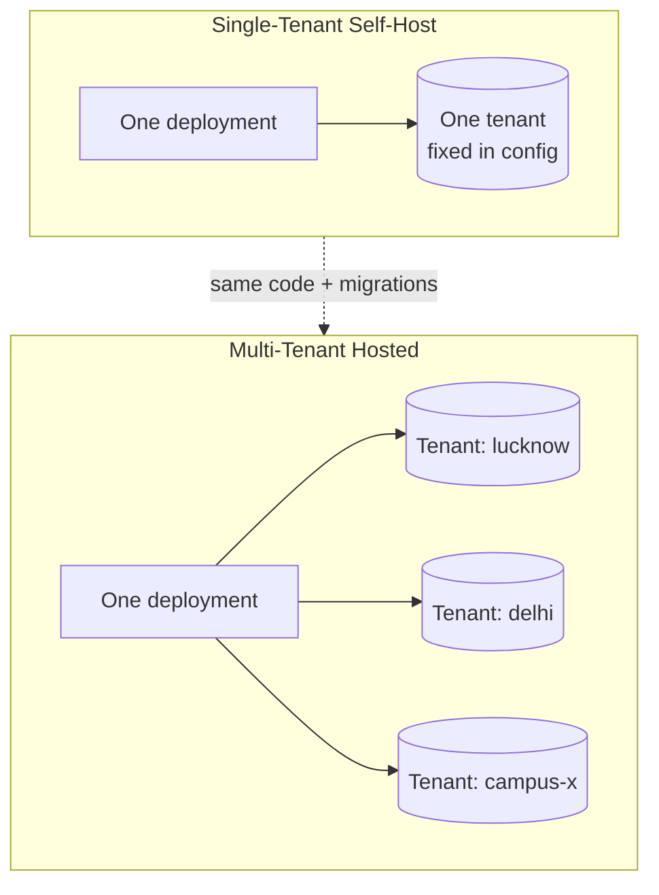
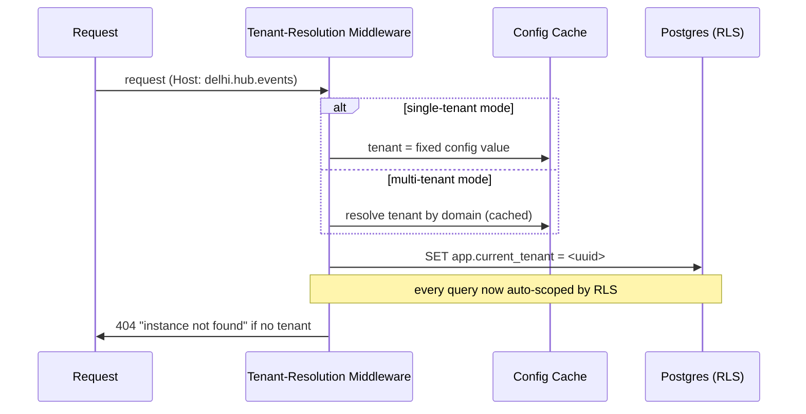
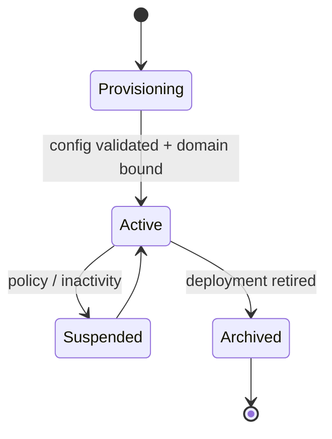

# 11 — Multi-Tenant Architecture

> **Companion to:** `06_System_Architecture.md` (§7 DB, §5 deployment), `04_ADR.md` (ADR-012/015), `05_Domain_Model.md`, `13_Instance_Configuration_Reference.md`
> **Scope:** How one codebase serves one self-hosted community *or* many communities — with correct isolation and zero per-tenant code.

---

## 1. Two deployment modes, one codebase (ADR-015)



- **Single-tenant self-host** (the default OSS path): a community clones, sets one config bundle, and runs. The active tenant is **fixed from config**; multi-tenancy is invisible. It must feel like a normal app.
- **Multi-tenant hosted:** an operator (e.g., UPAI Labs) runs many tenants from one deployment; the active tenant is **resolved per request by domain/subdomain**.

The difference is **resolution strategy + how many tenant rows exist** — not different code.

---

## 2. Isolation model: shared-schema + Row-Level Security

**Decision (ADR-015):** shared schema, `tenant_id` on every table, **PostgreSQL Row-Level Security** as the backstop.

**Why this over alternatives:**

| Model | Isolation | Self-host ops | Migration cost | Verdict |
|---|---|---|---|---|
| Database-per-tenant | Strongest | Heavy (many DBs) | High | ✗ kills self-host simplicity |
| Schema-per-tenant | Strong | Medium | High (N schemas migrate) | ✗ migration sprawl |
| **Shared-schema + RLS** | **Strong (enforced)** | **Light (one DB)** | **Low (one migration)** | **✓ chosen** |

RLS makes isolation a *database-enforced* property, so an application bug cannot leak across tenants.

```sql
-- illustrative
ALTER TABLE canonical_event ENABLE ROW LEVEL SECURITY;
CREATE POLICY tenant_isolation ON canonical_event
  USING (tenant_id = current_setting('app.current_tenant')::uuid);
```

---

## 3. Request path & tenant resolution



**Rules:**
- Tenant context is set **once per request**, before any query.
- Background/worker jobs carry `tenant_id` explicitly on the job payload and set context per job.
- A **super-admin** role (`BYPASSRLS`) exists only for provisioning and cross-tenant ops — never used on the request path.

---

## 4. What is tenant-scoped

Everything in the domain (`05`): events, source observations, sources, organizers, venues, categories/taxonomy, sponsors, subscribers, analytics, notifications, trust policy, and the **instance configuration** itself. Also tenant-prefixed:

- **Object storage keys:** `snapshots/{tenant}/…`, `feeds/{tenant}/…`
- **Cache/Redis keys:** `t:{tenant}:…`
- **Search index / projections:** partitioned or filtered by tenant.
- **Secrets:** provider credentials are per-tenant (each instance brings its own AI/notify/storage keys).

---

## 5. Tenant lifecycle



- **Provisioning:** create tenant row + load & validate `instance.yaml` (`13`) + seed default taxonomy/sources.
- **Active:** serving; config hot-reloadable where safe (branding/features), migration-gated where not.
- **Suspended/Archived:** data retained (graph is the asset, ADR-010); reads may be frozen.

---

## 6. Testing (mandatory)

Tenant isolation is a **security control**, tested like one:

- **Isolation tests (CI-gating):** a query under tenant A can never return tenant B's rows, at the service *and* DB (RLS) layers.
- **Resolution tests:** correct tenant per domain; single-tenant mode ignores Host.
- **Missing-policy detector:** a test that fails if any tenant-scoped table lacks an RLS policy.
- **Worker-context tests:** background jobs set and respect tenant context.

---

## 7. Single-tenant simplicity guarantee

The self-hoster must **not** pay the multi-tenant tax:
- Multi-tenant middleware short-circuits to the fixed tenant (no domain lookup).
- Docs and defaults assume single-tenant; multi-tenant is an opt-in mode.
- One tenant, one config, one command — that is the whole story for 95% of deployers.

> **Design tenets:** isolation is DB-enforced, resolution is one line of context, and the common case (one community, one instance) is dead simple.
