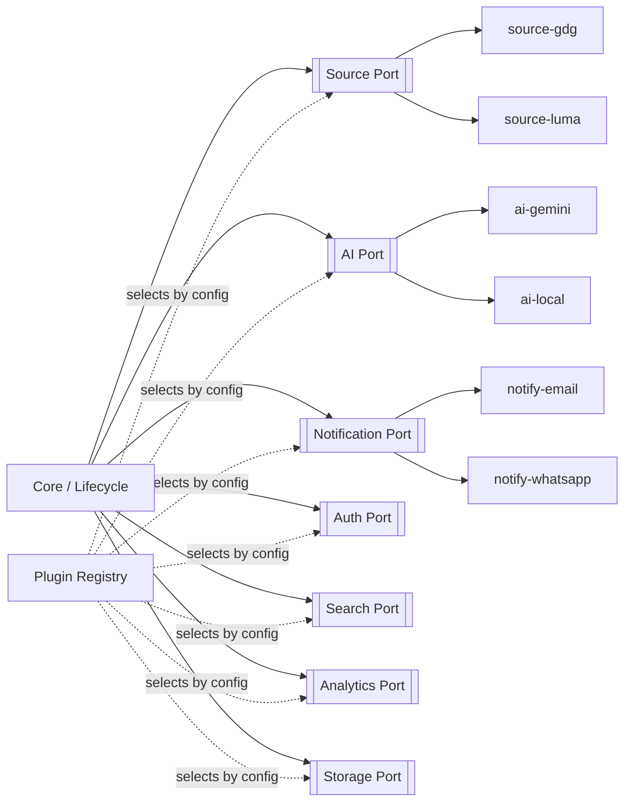

# 12 — Plugin Development Guide

> **Companion to:** `04_ADR.md` (ADR-014), `06_System_Architecture.md` (§13 gateway = reference AI port), `10_Architecture_Evolution.md` (§7 repo).
> **Scope:** The plugin ports, the registry, conformance testing, and how to build and ship a plugin. Merges the requested *Plugin* and *Extension* guides.

---

## 1. Principle: ports & adapters (ADR-014)

The **core depends only on interfaces (ports)**. Concrete implementations (adapters/plugins) are selected per tenant by configuration (`13`) and discovered via a registry. The core never imports a provider.



**The golden rule (ADR-014):** *a port earns its existence at the second implementation.* Do not abstract speculatively.

---

## 2. The seven ports

| Port | Responsibility | Core contract (conceptual) | Reference plugin |
|---|---|---|---|
| **Source** | Fetch raw event data from an origin | `discover() -> urls`, `fetch(url) -> RawCapture`, `external_id(raw)` | `source-gdg`, `source-luma`, `source-ics` |
| **AI** | Extraction, classification, summary, embedding, similarity | `extract(text) -> fields+confidence`, `classify(...)`, `embed(text)` | `ai-gemini` (the `06 §13` gateway is this port's reference) |
| **Notification** | Deliver digests/alerts | `send(channel, recipient, message)` | `notify-email`, `notify-whatsapp`, `notify-webhook` |
| **Auth** | Authenticate stewards/admins | `authenticate(credentials) -> principal`, `authorize(principal, action)` | `auth-jwt`, `auth-oauth` |
| **Search** | Index & query events | `index(doc)`, `query(q, filters) -> ranked` | `search-postgres`, `search-opensearch` |
| **Analytics** | Capture & expose interaction data | `capture(event)`, `rollup(...)` | `analytics-postgres`, `analytics-warehouse` |
| **Storage** | Blobs (snapshots, feeds, posters) | `put/get/exists/list` | `storage-s3`, `storage-local` |

> Ports express **capabilities**, not vendors. The core calls `AI.extract(...)`; whether that is Gemini, OpenAI, or a local model is a config choice.

---

## 3. Registry & selection

- Plugins **register** under their port with a unique id and a declared **plugin-API version**.
- A tenant's `providers` config (`13`) names the plugin id per capability.
- At startup/provisioning, the registry resolves and validates the selection; an incompatible API version fails fast.

```
providers:
  ai:     { plugin: ai-gemini, secret_ref: GEMINI_API_KEY }
  search: { plugin: search-postgres }
```

---

## 4. Conformance testing (required to ship)

Every port publishes a **conformance suite**. A plugin is not "done" until it passes:

- **Contract tests:** implements the full interface with correct types/semantics.
- **Behavior tests:** golden-input → expected-output (e.g., a Source plugin returns valid `RawCapture`; an AI plugin returns schema-valid extraction).
- **Failure tests:** timeouts, malformed input, provider errors are handled, not thrown into the lifecycle.
- **Security tests (Source/AI especially):** honors SSRF/egress limits; treats scraped text as data, not instructions (prompt-injection resistance, per `06 §19`).

Conformance-passing is the **review gate** for community plugins — it makes maintainer review tractable (reduces the `08` bus-factor burden).

---

## 5. Building a plugin (workflow)

```
1. sdk/ new-plugin --port source --id source-meetup
2. implement the port interface
3. run the conformance suite: sdk/ conformance source-meetup
4. add example config + docs
5. open PR → CI runs conformance → maintainer review
```

- Plugins live in `plugins/<port>-<id>/`, depend on `sdk/` + one port, and **never** import core internals.
- **Versioning:** a plugin declares the plugin-API version it targets; breaking port changes bump the plugin-API major (`14`).
- **Trust tiers:** official → community-verified → experimental. Untrusted source plugins run under stricter capability limits.

---

## 6. Anti-patterns (rejected in review)

- Importing another plugin or core internals (couples the ecosystem).
- Reading global/tenant state directly instead of via injected context.
- Provider-specific logic leaking a vendor concept into the port’s vocabulary.
- Abstracting a port with only one implementation (premature — ADR-014).

> **Tenet:** a good plugin is replaceable, conformance-tested, self-contained, and knows nothing about the core beyond its one port.
