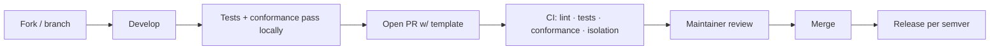

# 14 — Contribution & Open-Source Guide

> **Companion to:** `10_Architecture_Evolution.md` (§7 repo, §9 OSS readiness), `12_Plugin_Development_Guide.md`, `13_Instance_Configuration_Reference.md`
> **Scope:** How outsiders deploy, extend, and contribute. This is the OSS operating manual — the antidote to the bus-factor risk in `08`.

---

## 1. Ways to participate

| You want to… | Path | Guide |
|---|---|---|
| **Run your own instance** | Copy a deployment config, add secrets, deploy | `13` + Quickstart (§3) |
| **Add a data source** | Build a Source plugin | `12` |
| **Swap a provider** (AI/notify/search…) | Build/select a plugin | `12` + `13` |
| **Improve the core** | PR against `core/` | §4 |
| **Fix docs** | PR against `docs/` | §4 |

---

## 2. Repository layout (recap of `10 §7`)

`core/` (ports only) · `plugins/` · `apps/web` · `deployments/` (config, no code) · `sdk/` · `docs/` · `infra/` · `examples/`.
**Invariant:** `core/` imports only `core/ports/`; `deployments/` contain zero code.

---

## 3. Quickstart — launch a deployment

```
1. cp -r deployments/_example deployments/<your-tenant>
2. edit deployments/<your-tenant>/instance.yaml   # branding, timezone, sources, providers
3. provide provider secrets (AI key, storage creds, ...)
4. run: make deploy TENANT=<your-tenant>
```

No source changes. If step 2 required editing code, that is a bug against ADR-013 — file it.

---

## 4. Contribution workflow



- **Every PR:** green CI (lint, unit, integration), and — for plugins — the port **conformance suite** (`12`).
- **Core PRs touching tenancy:** must include **tenant-isolation tests** (`11 §6`).
- **Config-over-code gate:** CI fails if business logic references a specific tenant/city/provider (ADR-013 enforced mechanically).
- **Conventional commits**; PR templates; `good-first-issue` labels for newcomers.

---

## 5. Versioning

Two independently versioned surfaces (both semver):

| Surface | Version | Breaking change means |
|---|---|---|
| **Core** | `core-vX.Y.Z` | Domain/lifecycle/config-schema breaking change |
| **Plugin API** | `plugin-api-vX` | A port interface changed; plugins must target a compatible major |

- Config carries `schema_version`; migrations handle bumps.
- A compatibility matrix documents which plugin-API versions each core release supports.

---

## 6. Testing expectations

| Layer | Required for |
|---|---|
| Unit (decision functions) | any core change (per `09`/`08` — these decide what publishes) |
| Conformance | any plugin |
| Tenant isolation | any tenancy-touching change |
| Golden dataset | any pipeline/dedup/trust change |
| Config validation | any schema change |

---

## 7. Governance (lightweight)

- **Maintainers** own core + official plugins; **community** owns their own plugins/deployments.
- **Decisions** of architectural weight are recorded as **ADRs** (append-only, like `04`).
- **License:** permissive enough to encourage deployment and contribution (choose at launch; document in repo).
- **Support boundary:** the platform ships the tools; each deployment owns its own legal/DPDP compliance (per-instance checklist from `08`/`E00-S2`, referenced in `13 §compliance`).

---

## 8. The maintainer's honest note (carrying `08` forward)

Open source is a **commitment**, not a license file. Reviews, versioning, docs, and plugin support are real, recurring work. Two guardrails keep it sustainable:

1. **Conformance tests do the first review** — plugins that fail don't reach a human.
2. **Keep the plugin surface small** until contributors arrive — abstract a port only at its second implementation (ADR-014).

If neither the maintainer time nor the community exists yet, that is fine — ship the **single-tenant self-host** path beautifully, keep the seams clean, and let the ecosystem features activate on the schedule adoption earns.

> **Tenet:** a stranger should be able to deploy an instance, ship a plugin, and open a merged PR **without ever talking to us.** That is the definition of done for "open source."
